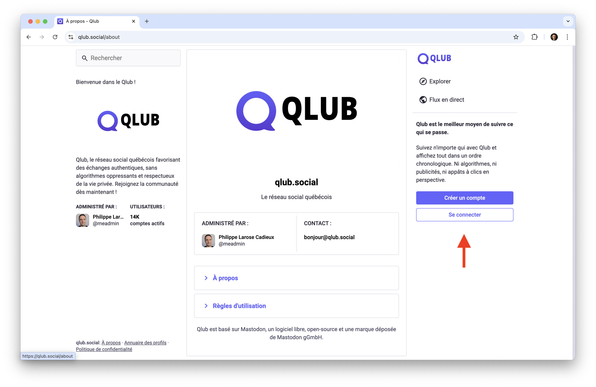
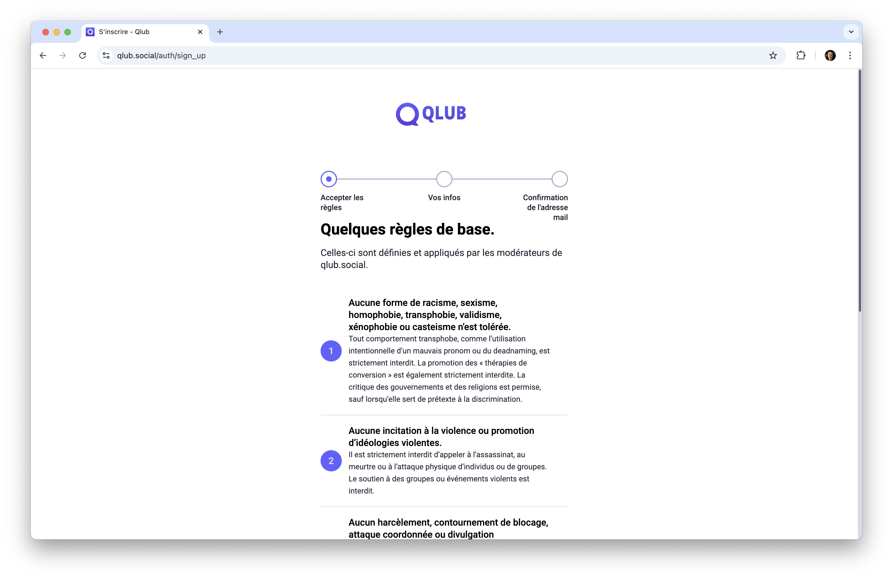
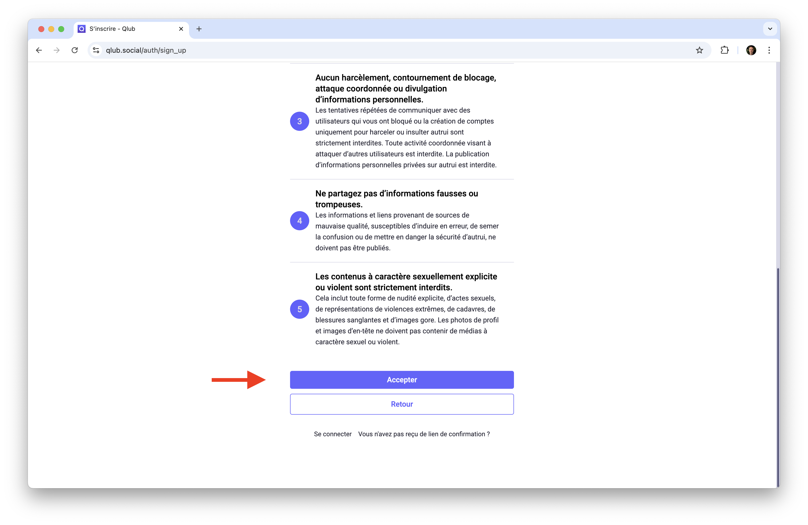
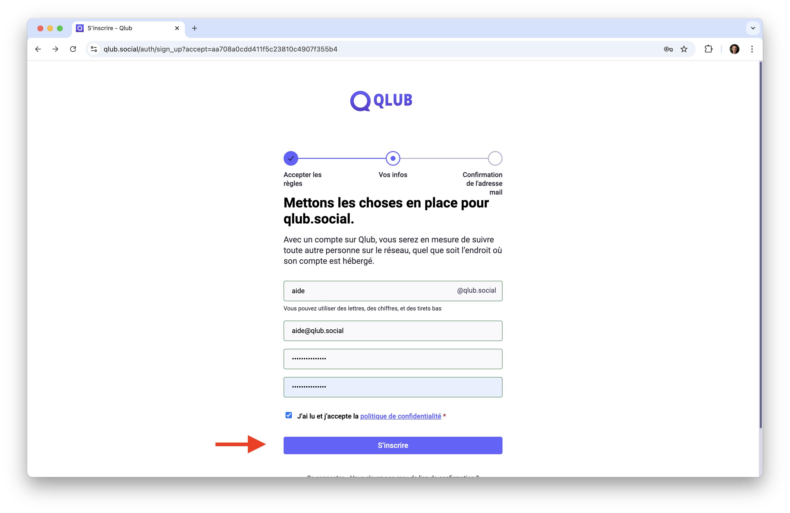
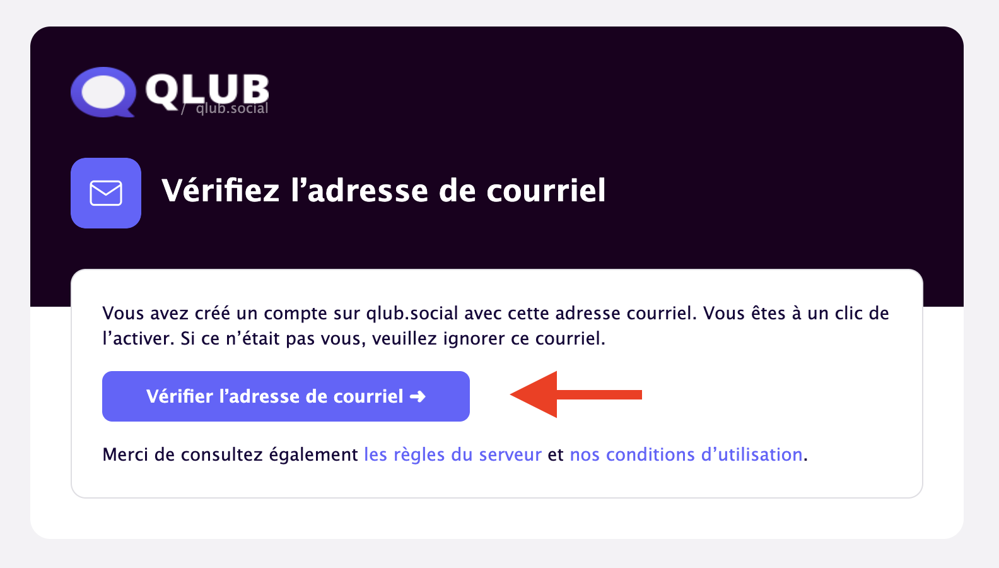
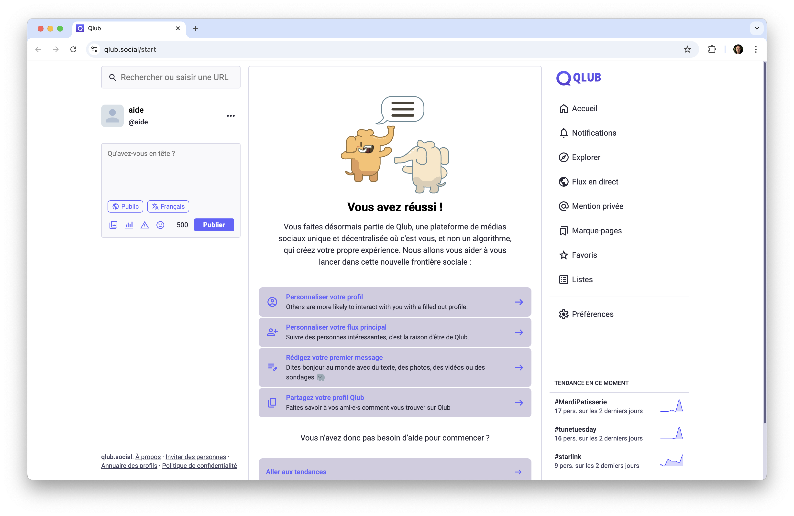

# 👤 Créer votre compte sur Qlub

Ce guide vous explique comment créer un compte sur Qlub et commencer à explorer la plateforme.

## Étapes pour créer un compte

1. **Accéder à la page d'inscription**
   - Visitez [qlub.social](https://qlub.social) et cliquez sur "Créer un compte".

2. **Accepter les règles d'utilisation**
   - Avant de créer votre compte, vous devez lire et accepter les règles de la communauté.
   - Ces règles sont essentielles pour maintenir une communauté saine et respectueuse.
   - Prenez le temps de les lire attentivement.

*Capture d'écran : Début des règles de la communauté*

3. **Remplir le formulaire d'inscription**
   - Entrez votre nom d'utilisateur, votre adresse e-mail et choisissez un mot de passe sécurisé.
   - Assurez-vous que votre mot de passe est suffisamment fort pour protéger votre compte.

4. **Vérifier votre e-mail**
   - Après avoir soumis le formulaire, vous recevrez un e-mail de vérification.
   - Cliquez sur le lien dans l'e-mail pour activer votre compte.

## 🎉 Félicitations !

Votre compte Qlub est maintenant créé et configuré ! Vous êtes prêt à :
- Explorer la plateforme
- Suivre d'autres utilisateurs
- Publier du contenu
- Interagir avec la communauté

N'hésitez pas à consulter nos autres guides pour en savoir plus sur les fonctionnalités de Qlub.

## ➡️ Guide suivant

Consultez notre guide sur la [configuration de votre profil](profile.md) pour personnaliser votre compte et vos paramètres.

---

[🏠 Retour à l'accueil](../index.md)