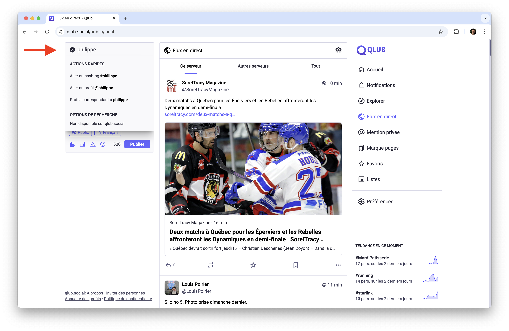
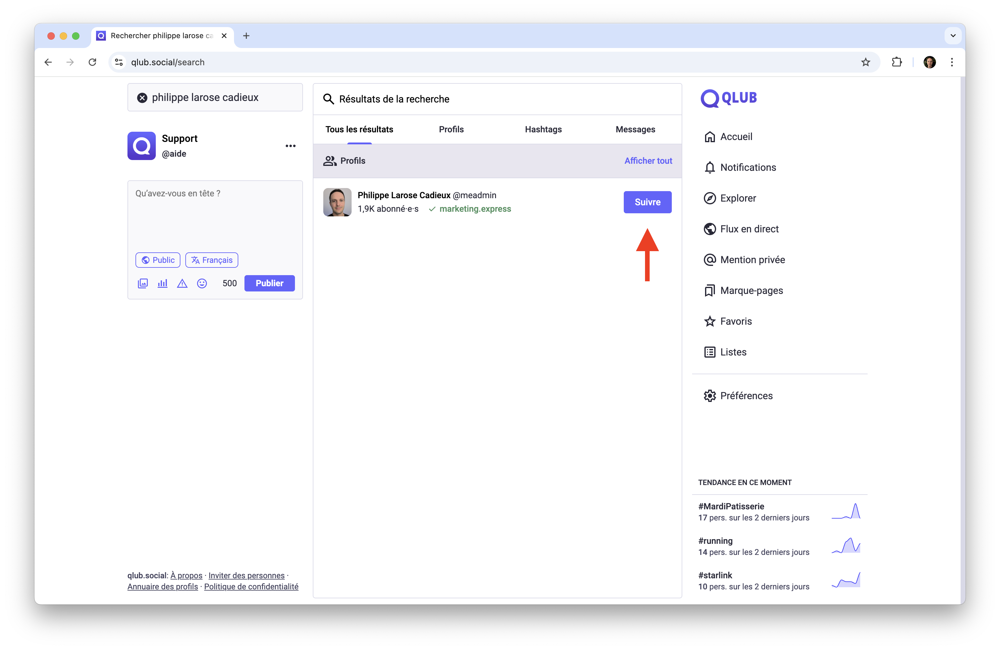
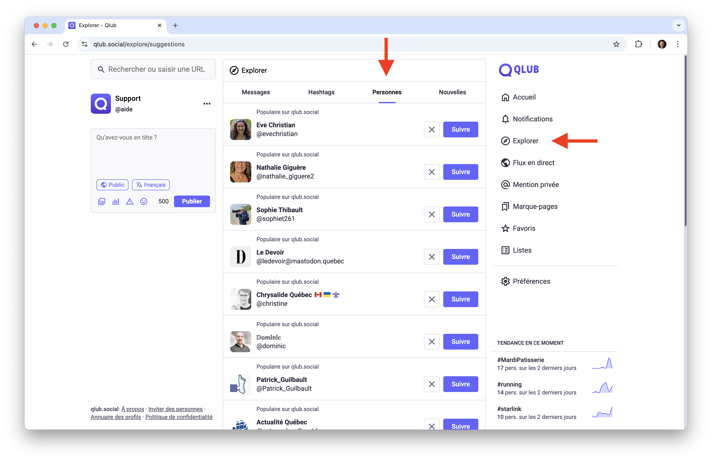
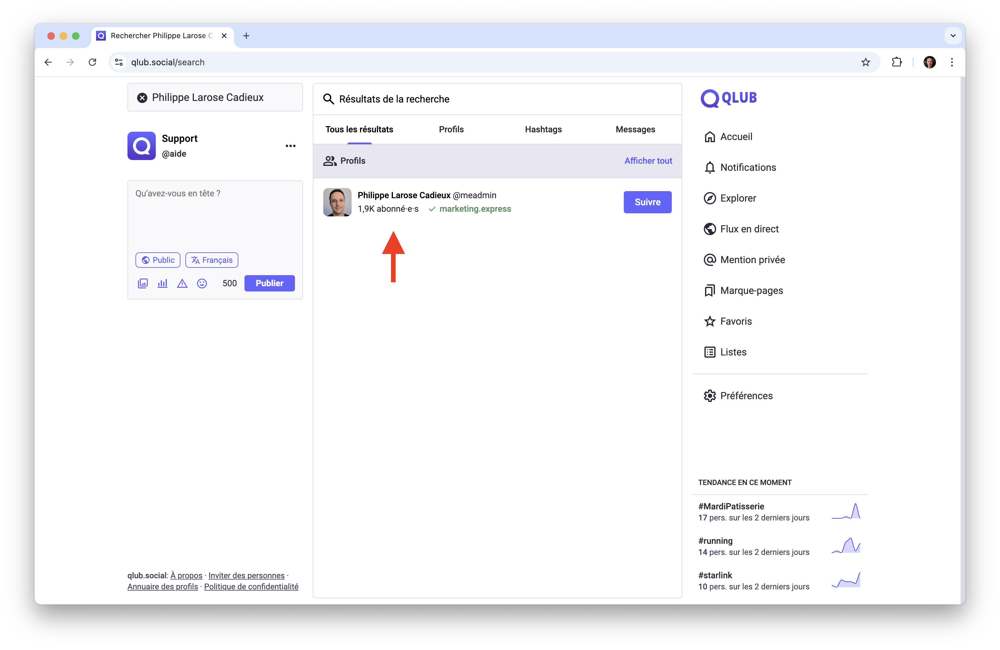
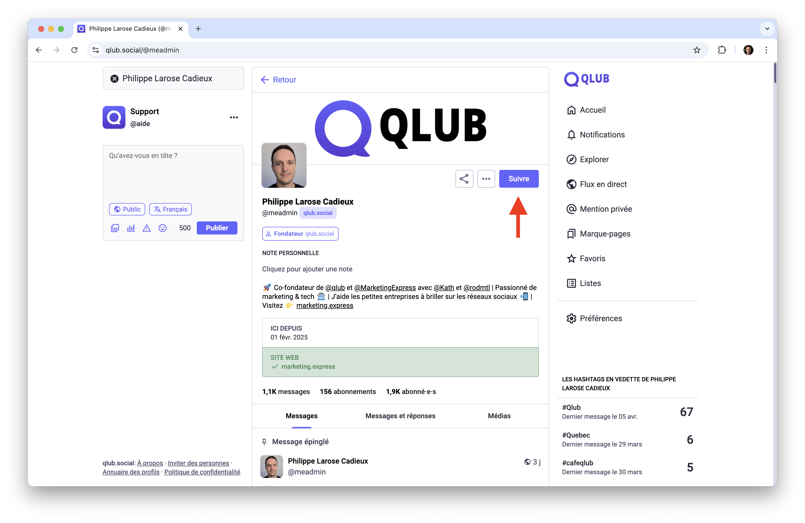
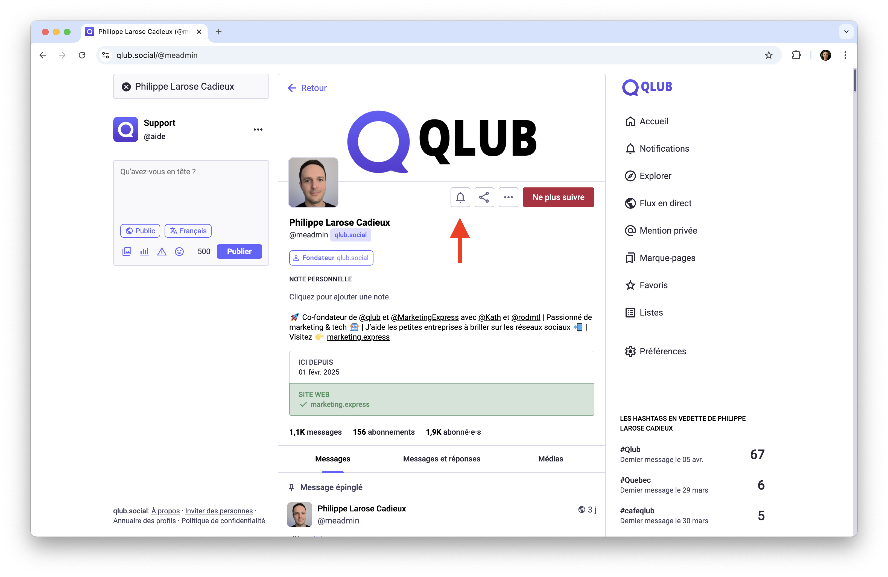
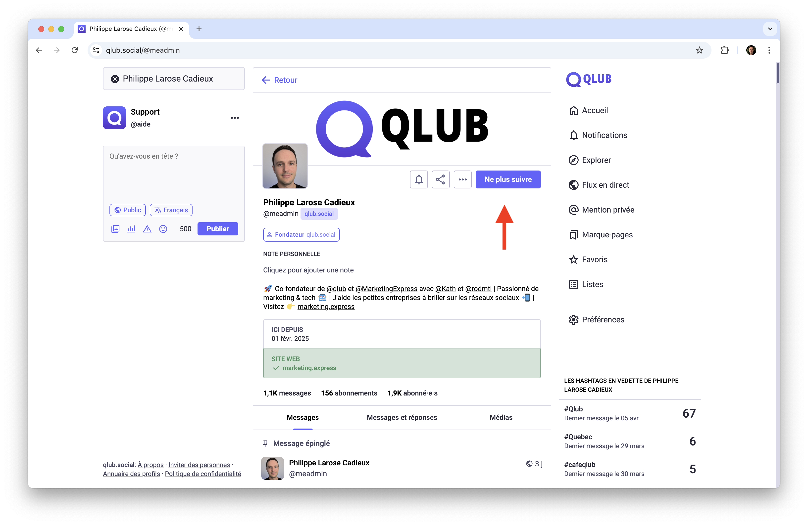
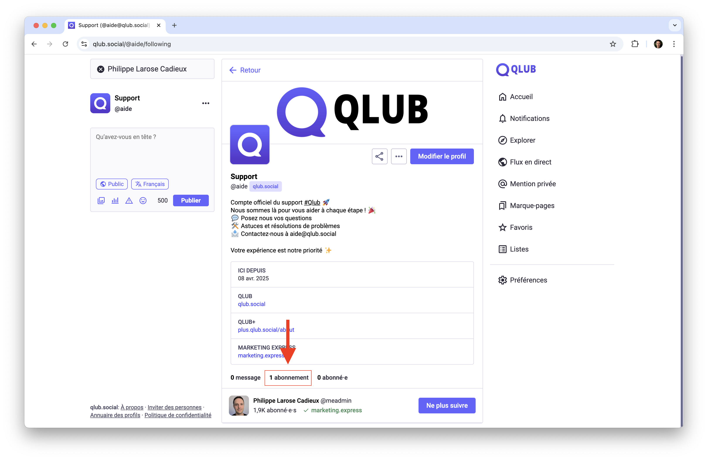

# 👥 Suivre des comptes sur Qlub

Ce guide vous explique comment trouver et suivre des comptes intéressants sur Qlub.

## 🔍 Rechercher des comptes

### Utiliser la barre de recherche
- Entrez un nom d'utilisateur ou un nom public dans la barre de recherche
- Les résultats affichent les profils correspondants

### Parcourir les résultats
- Consultez les profils suggérés dans les résultats
- Cliquez sur un profil pour voir plus de détails

## 🎯 Découvrir des comptes

### Profils suggérés
- Explorez les suggestions basées sur vos intérêts
- Trouvez des comptes similaires dans la section "Explorer"
- Découvrez de nouveaux profils dans votre fil d'actualité

## ➕ Suivre un compte

### Étapes pour suivre
1. Visitez le profil que vous souhaitez suivre

2. Cliquez sur le bouton "Suivre"

3. Configurez vos préférences de notification

### Se désabonner
- Accédez au profil concerné
- Cliquez sur "Ne plus suivre"

## 📋 Gérer vos abonnements

### Voir la liste
1. Allez sur votre profil
2. Cliquez sur "Abonnements"
3. Consultez tous les comptes suivis

## ➡️ Guide suivant

Découvrez comment interagir avec le contenu sur Qlub :
[👍 Interagir avec le contenu](interacting.md)

---

[🏠 Retour à l'accueil](../index.md)
