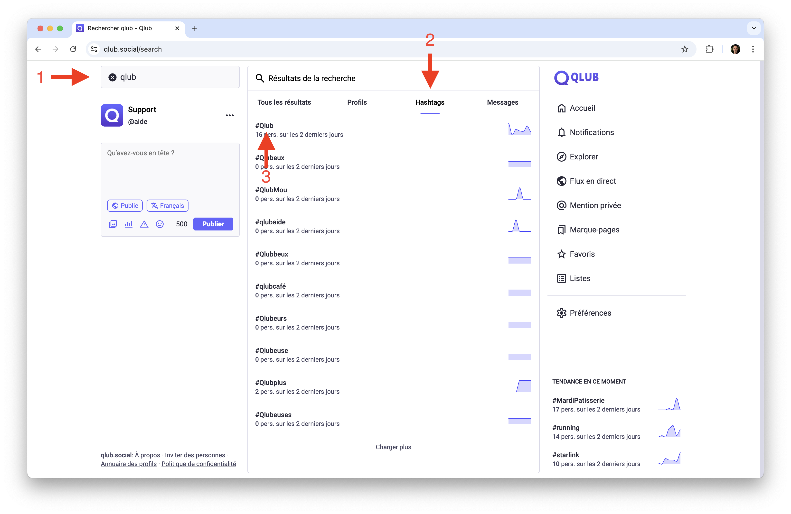
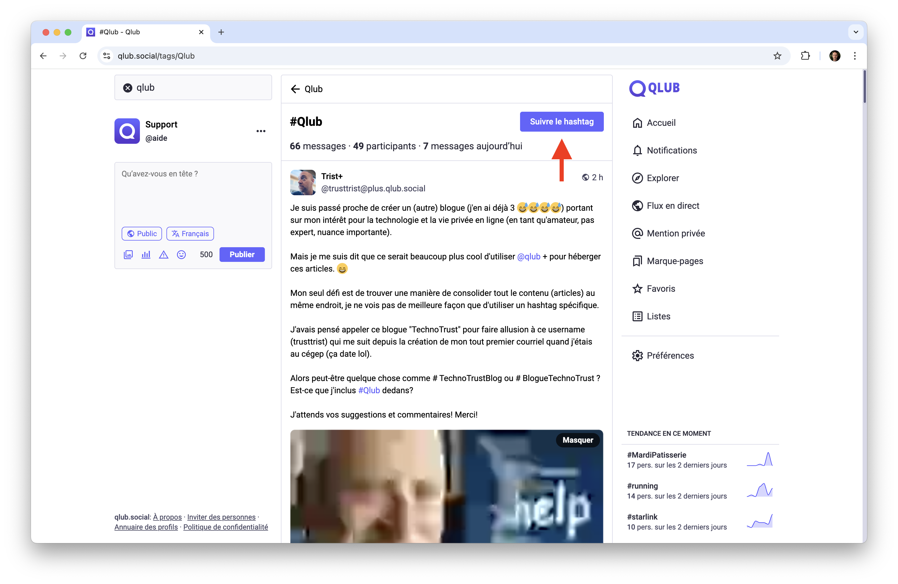
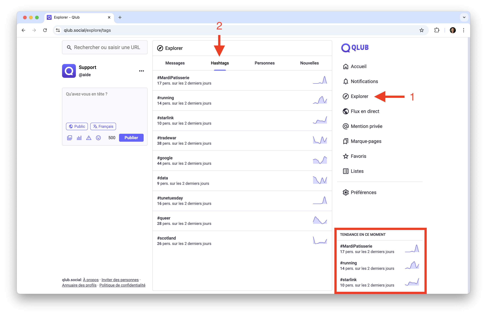
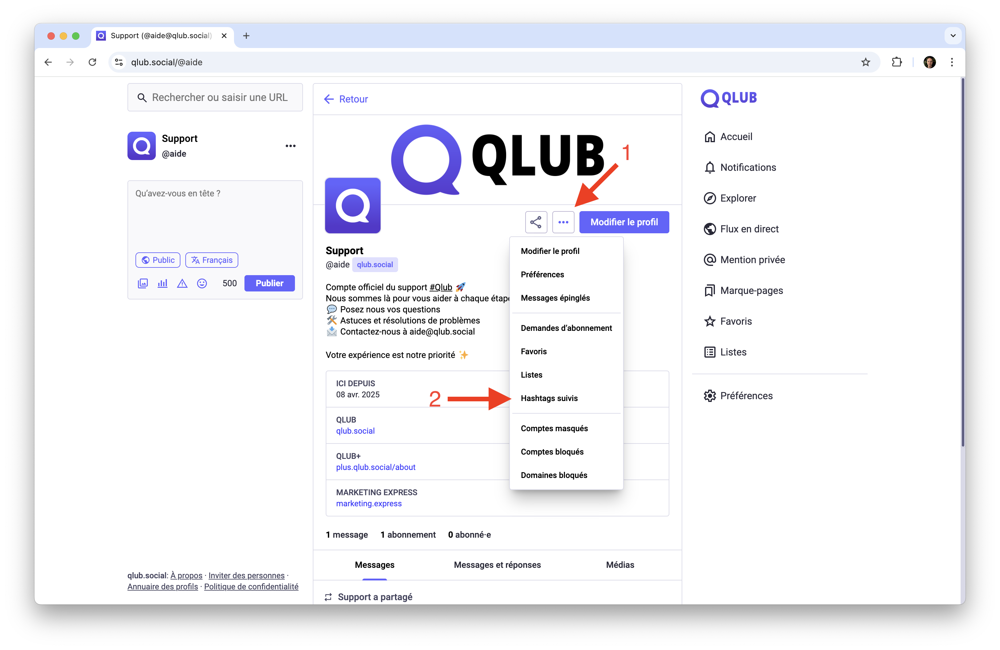
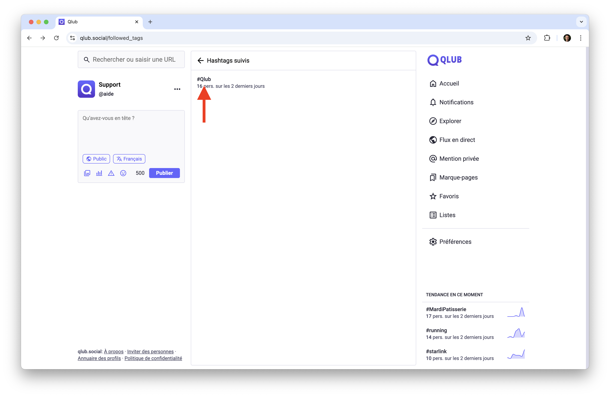
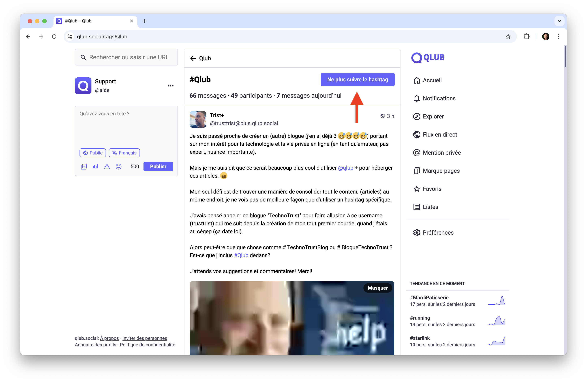

# 📈 Utiliser les hashtags sur Qlub

Ce guide vous explique comment utiliser efficacement les hashtags sur Qlub pour organiser votre contenu et le rendre plus visible.

## 🔍 Suivre un hashtag

Suivre des hashtags vous permet de rester informé sur des sujets spécifiques.

### Comment suivre un hashtag
1. Recherchez un hashtag dans la barre de recherche

2. Cliquez sur le hashtag pour accéder à sa page
3. Cliquez sur "Suivre" pour vous abonner et voir les messages contenant ce hashtag dans votre fil d'actualité

## 📊 Hashtags tendances

Découvrez les hashtags les plus populaires sur Qlub.

### Accéder aux hashtags tendances
1. Cliquez sur l'icône "Explorer" dans la barre de navigation
2. Sélectionnez l'onglet "Hashtags"
3. Parcourez les hashtags populaires du moment

## 🛠️ Gérer les hashtags suivis

1. Accédez à votre profil
2. Cliquez sur les trois points de menu (...)

3. Sélectionnez "Hashtags suivis" dans le menu
4. Cliquez sur le hashtag que vous souhaitez gérer

5. Cliquez sur "Ne plus suivre" pour vous désabonner du hashtag

## ➡️ Guide suivant

Découvrez comment modérer votre expérience sur Qlub :
[🛡️ Modération](moderation.md)

---

[🏠 Retour à l'accueil](../index.md)