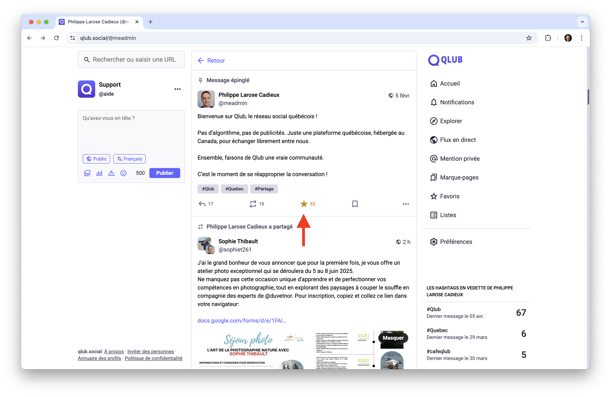
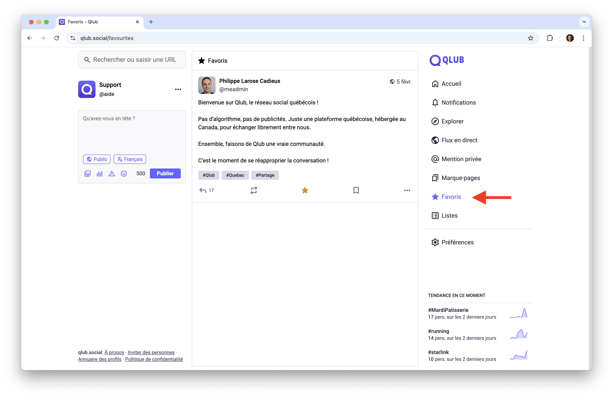
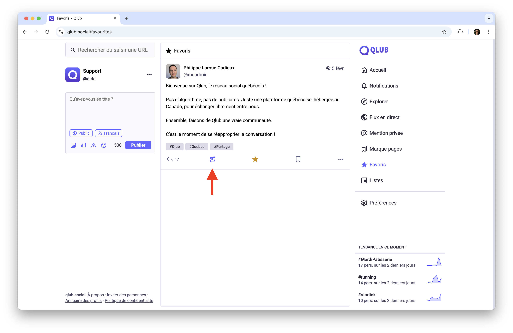
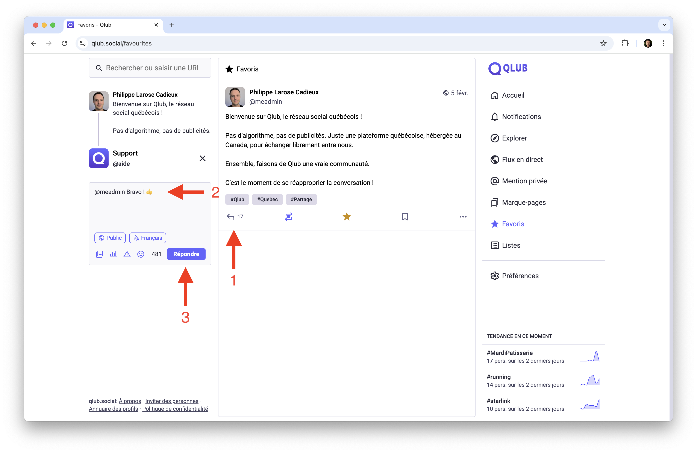
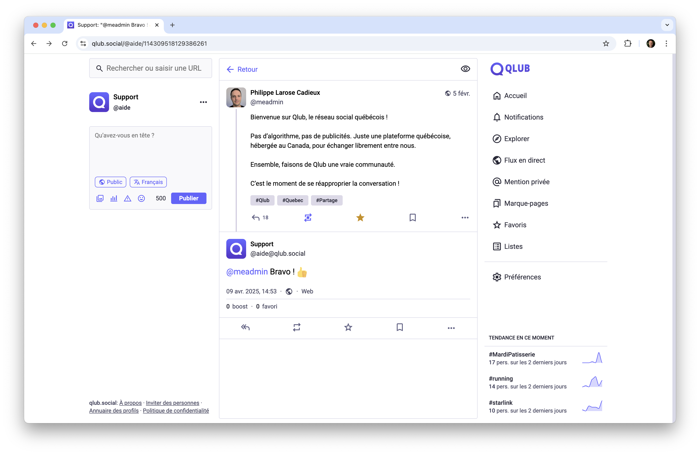
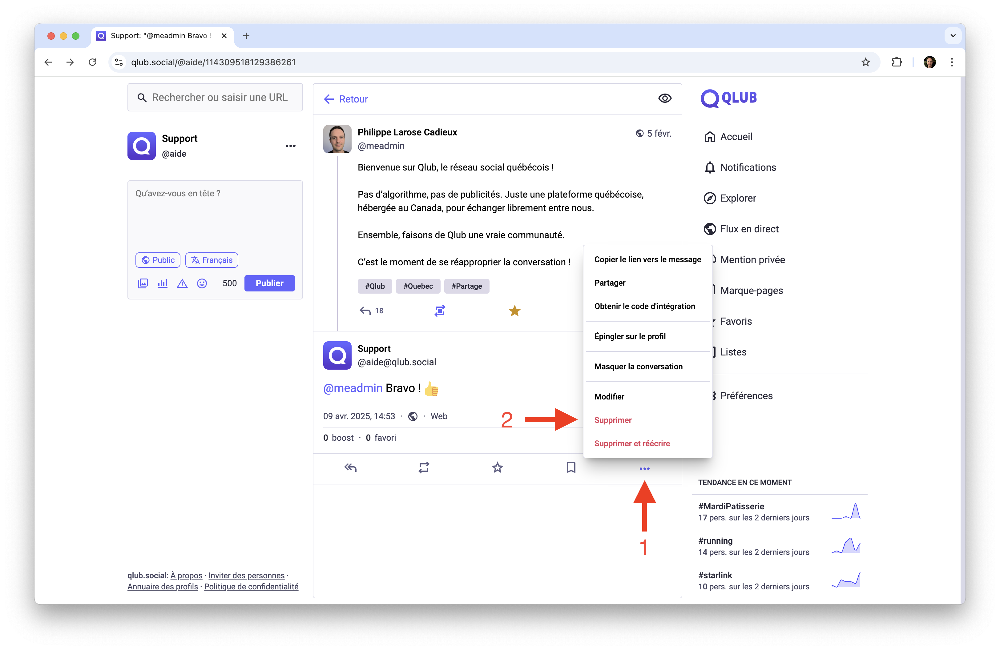
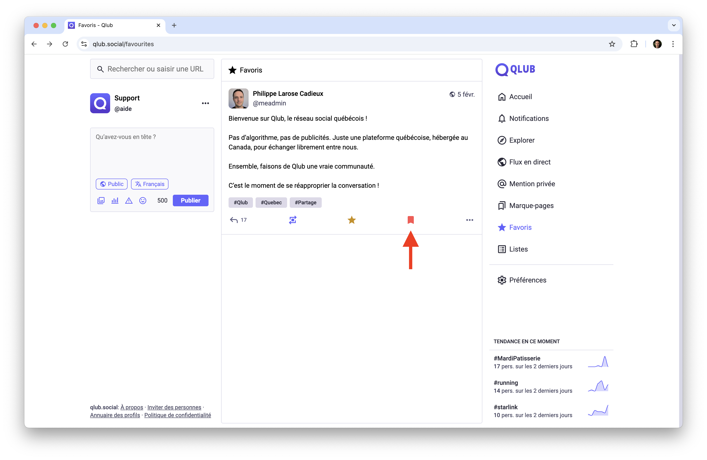
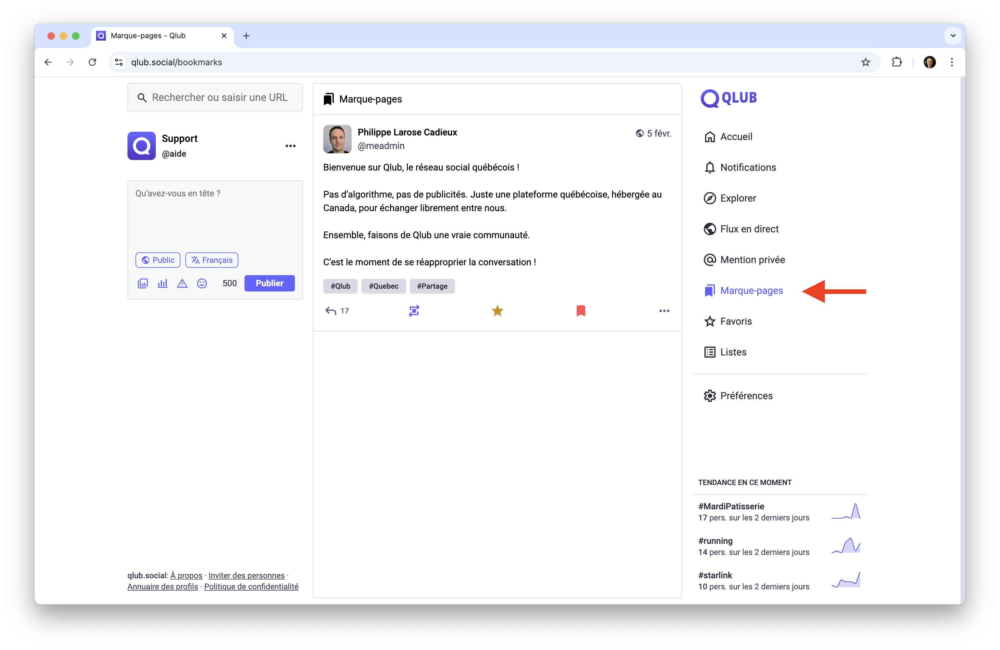

# 👍 Interagir avec le contenu sur Qlub

Ce guide vous explique comment interagir avec le contenu sur Qlub pour enrichir votre expérience.

## ⭐️ Favoris ("Like")

Les favoris vous permettent de marquer les publications que vous appréciez.

### Comment ajouter un favori
1. Trouvez une publication que vous aimez
2. Cliquez sur l'icône "étoile" sous la publication
3. L'icône se remplit pour indiquer que vous avez ajouté un favori

### Gestion des favoris
- Accédez à vos favoris via la barre de navigation
- Retirez un favori en cliquant à nouveau sur l'icône "étoile"
- Utilisez les favoris pour retrouver facilement du contenu

## 🔁 Repartager

Le repartage vous permet de partager des publications avec vos abonnés.

### Comment repartager
1. Trouvez une publication que vous souhaitez partager
2. Cliquez sur l'icône "repartager"
3. L'icône se remplit pour indiquer que vous avez repartagé

### Gestion des repartages
- Consultez vos repartages dans votre profil

## ↩️ Répondre

Répondez aux publications pour participer aux discussions.

### Comment répondre
1. Trouvez une publication à laquelle vous souhaitez répondre
2. Cliquez sur l'icône "répondre"
3. Rédigez votre réponse dans le champ prévu
4. Cliquez sur "Envoyer"

### Voir le fil de discussion
- Cliquez sur le texte d'une publication pour voir le fil de discussion complet
- Cela vous permet de voir toutes les réponses et interactions liées à cette publication

## 🗑️ Supprimer un message

Vous pouvez supprimer vos propres publications si nécessaire.

### Comment supprimer une publication
1. Trouvez la publication que vous souhaitez supprimer
2. Cliquez sur les trois points (...) en bas à droite de la publication
3. Sélectionnez "Supprimer"
4. Confirmez la suppression dans la fenêtre de dialogue

### Important à savoir
- La suppression est définitive et ne peut pas être annulée
- Les réponses à votre publication resteront visibles
- Les repartages de votre publication seront automatiquement retirés

## 🔖 Marque-pages

Les marque-pages vous permettent de sauvegarder des publications importantes.

### Comment ajouter un marque-page
1. Trouvez une publication que vous souhaitez sauvegarder
2. Cliquez sur l'icône "marque-page"
3. L'icône se remplit pour indiquer que la publication est sauvegardée

### Gestion des marque-pages
- Accédez à vos marque-pages via la barre de navigation
- Retirez un marque-page en cliquant à nouveau sur l'icône

## ➡️ Guide suivant

Découvrez comment créer et gérer des listes d'utilisateurs :
[📋 Les listes](lists.md)

---

[🏠 Retour à l'accueil](../index.md)