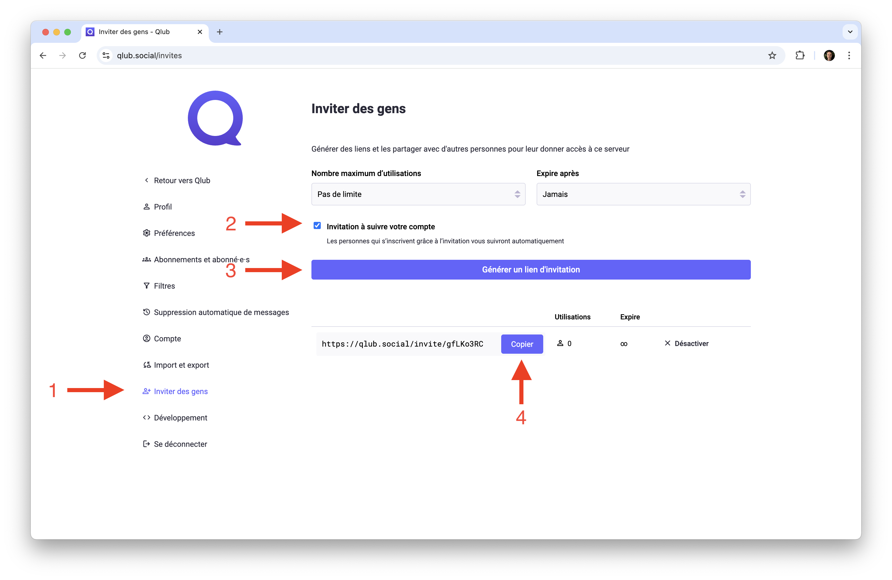

# Inviter des personnes sur Qlub

Ce guide vous explique comment inviter des amis, collègues ou membres de votre communauté à rejoindre Qlub.

## 🔗 Générer un lien d'invitation

Créez des liens d'invitation pour inviter facilement des utilisateurs à rejoindre Qlub.

### Étapes pour générer un lien
1. Cliquez sur "Préférences" dans la barre de navigation
2. Cliquez sur "Inviter des personnes" dans la barre latérale
3. Cochez "Invitation à suivre votre compte" si vous le souhaitez
4. Cliquez sur "Générer un lien d'invitation"
5. Cliquez sur "Copier"
6. Partagez le lien dans votre réseau (courriel, texto, autres réseaux sociaux, etc.)

## ➡️ Guide suivant

Découvrez comment utiliser Qlub sur mobile :
[📱 Application Mobile](mobile.md)

---

[🏠 Retour à l'accueil](../index.md)
