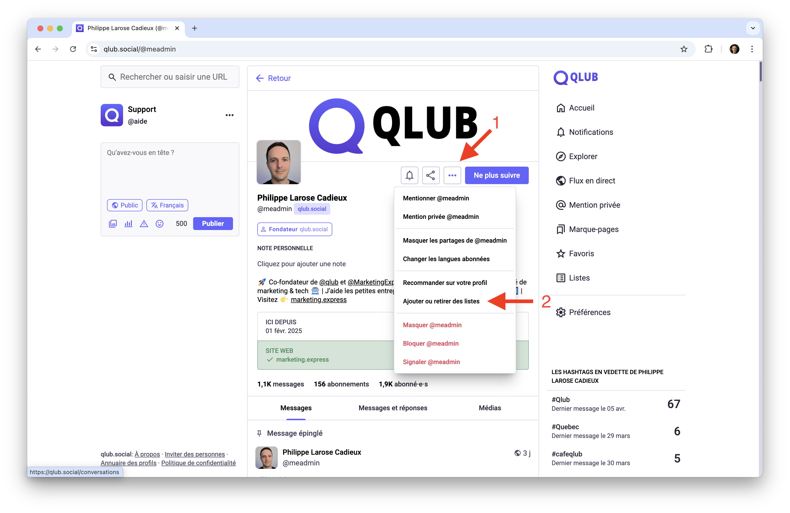
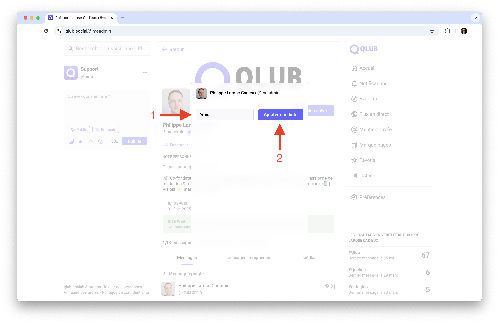
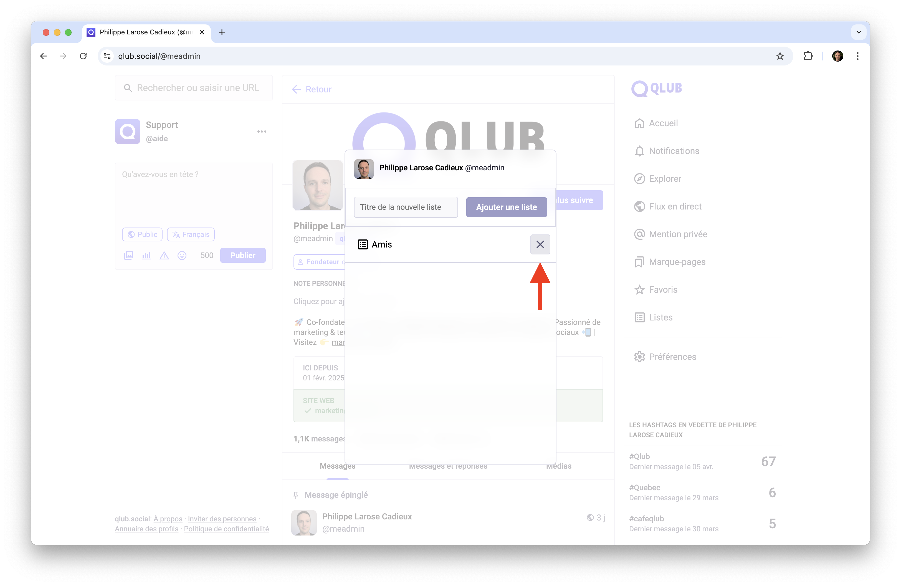
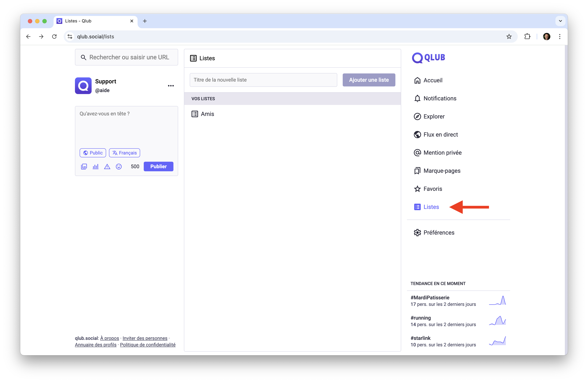

# 📋 Gérer vos listes sur Qlub

Ce guide vous explique comment créer et gérer des listes sur Qlub pour organiser vos abonnements et créer des flux personnalisés basés sur des thématiques spécifiques.

## ➕ Créer et ajouter un compte à une liste

Les listes vous permettent de regrouper des comptes par thème ou intérêt.

1. Accédez à un profil auquel vous êtes abonné
2. Cliquez sur les "..."
3. Cliquez sur "Ajouter ou retirer des listes"

4. Entrez un nom et cliquez sur "Ajouter une liste"

5. Cliquez sur "+"

## 👀 Voir vos listes

Pour consulter vos listes :
1. Cliquez sur "Listes" dans la barre de navigation
2. Sélectionnez une liste dans le menu latéral
3. Le fil d'actualité affichera uniquement les publications des comptes de cette liste

## ➡️ Guide suivant

Découvrez comment utiliser les hashtags pour trouver et organiser du contenu :
[#️⃣ Les hashtags](hashtags.md)

---

[🏠 Retour à l'accueil](../index.md)