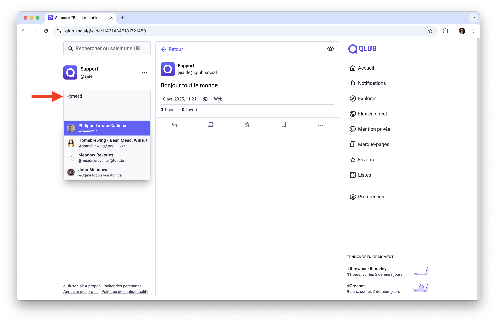
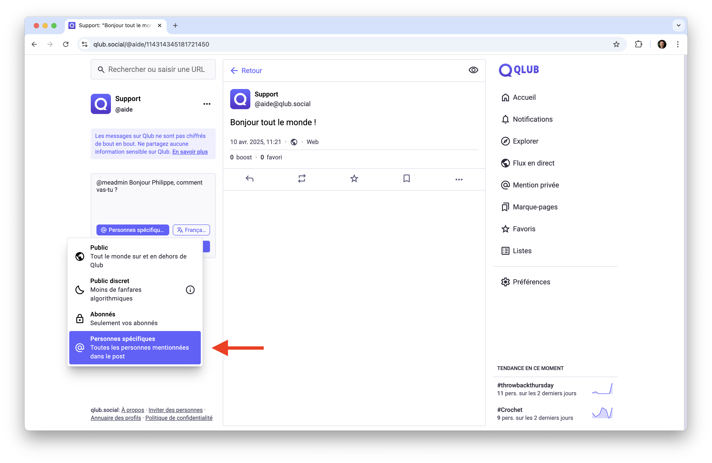

# 📌 Utiliser les mentions sur Qlub

Ce guide vous explique comment utiliser les mentions pour communiquer avec d'autres utilisateurs sur Qlub.

## 🔍 Comment mentionner un utilisateur

Pour mentionner un utilisateur dans votre message, suivez ces étapes :

1. Commencez à taper le symbole `@` dans votre message.
2. Une liste d'utilisateurs apparaîtra. Sélectionnez l'utilisateur que vous souhaitez mentionner.
3. L'utilisateur sera notifié de votre mention.

## Qu'est-ce qu'une mention privée ?

Une mention privée est un message privé aussi appelé message direct. Il n'est visible que pour les personnes mentionnées dans le message.

## Comment envoyer une mention privée

1. **Rédiger un message**
   - Utilisez @ pour mentionner un utilisateur
   - Ajoutez du texte
   - Insérez des médias ou sondages si nécessaire

2. **Configurer la visibilité**
   - Cliquez sur l'icône de visibilité
   - Sélectionnez "Personnes spécifiques"
   

3. **Envoyer**
   - Cliquez sur "Publier"

## ⚠️ Avertissement sur la confidentialité
Les messages sur Qlub ne sont pas chiffrés. Ne partagez pas d'informations dangereuses ou sensibles via des mentions privées. Qlub n'est pas une application de messagerie chiffrée comme Signal ou Matrix. Les administrateurs de la base de données des serveurs de l'expéditeur et du destinataire peuvent avoir accès au texte.

## ➡️ Guide suivant

Découvrez comment sécuriser votre compte Qlub :
[🔒 Sécurité](security.md)

---

[🏠 Retour à l'accueil](../index.md)
