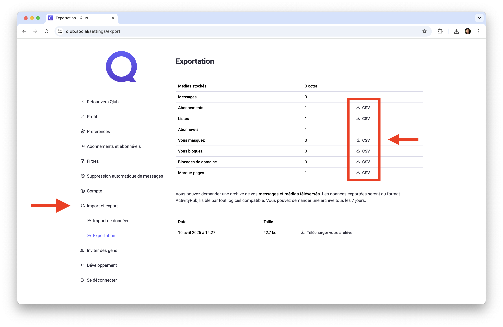

# ↗️ Guide de migration de Qlub vers Qlub+

Ce guide vous accompagne dans la migration de votre compte Qlub vers Qlub+, tout en conservant vos abonnements et vos listes.

## Étape 1 : Exportez vos données de Qlub

1. Connectez-vous à votre compte **Qlub** sur [qlub.social](https://qlub.social)
2. Accédez à **Préférences > Import et export > Exportation**
3. Téléchargez, un à un, tous les fichiers CSV disponibles (abonnements, listes, comptes bloqués, etc.)
4. Enregistrez-les dans un endroit sûr sur votre ordinateur

> **Note** : Vous ne pouvez pas exporter vos messages. Vos abonnés seront automatiquement transférés à l'étape 4.

## Étape 2 : Importez vos données dans Qlub+

1. Connectez-vous à votre compte **Qlub+** sur [plus.qlub.social](https://plus.qlub.social)
2. Allez dans **Préférences > Import et export > Importation de données**
3. Importez vos fichiers CSV, un à un :
   - Choisissez le type de données dans le menu déroulant
   - Sélectionnez le fichier correspondant
   - Cliquez sur **Importer**
4. Répétez pour chaque fichier téléchargé

## Étape 3 : Redirigez vos abonnés vers Qlub+

1. Depuis Qlub+, allez dans **Préférences > Compte > Paramètres du compte**
2. Dans la section **Déplacement depuis un compte différent**, cliquez sur **Créer un alias de compte**
3. Entrez l'adresse de votre ancien compte Qlub (exemple : votre-identifiant-qlub@qlub.social)
4. Cliquez sur **Créer un alias**

## Étape 4 : Activez la migration depuis Qlub

1. Connectez-vous à votre compte **Qlub** sur [qlub.social](https://qlub.social)
2. Accédez à **Préférences > Compte > Paramètres du compte**
3. Dans la section **Déménager vers un compte différent**, cliquez sur **Configurer ici**
4. Indiquez l'identifiant de votre compte Qlub+ (exemple : votre-identifiant-qlub-plus@plus.qlub.social)
5. Entrez le mot de passe de votre compte Qlub
6. Cliquez sur **Migrer les abonnés**

---

[🏠 Retour à l'accueil](../index.md)
