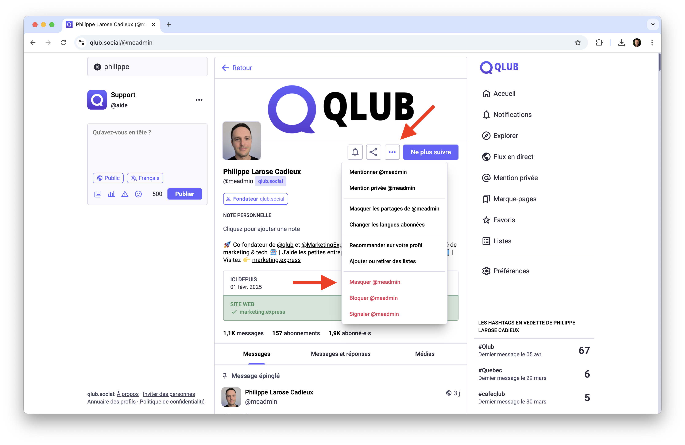
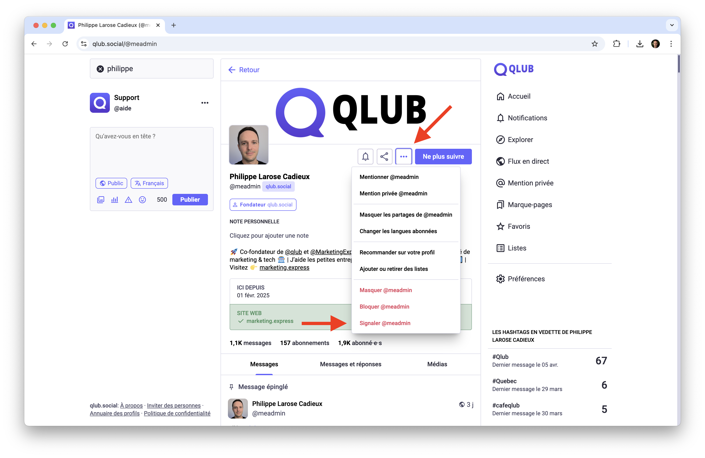
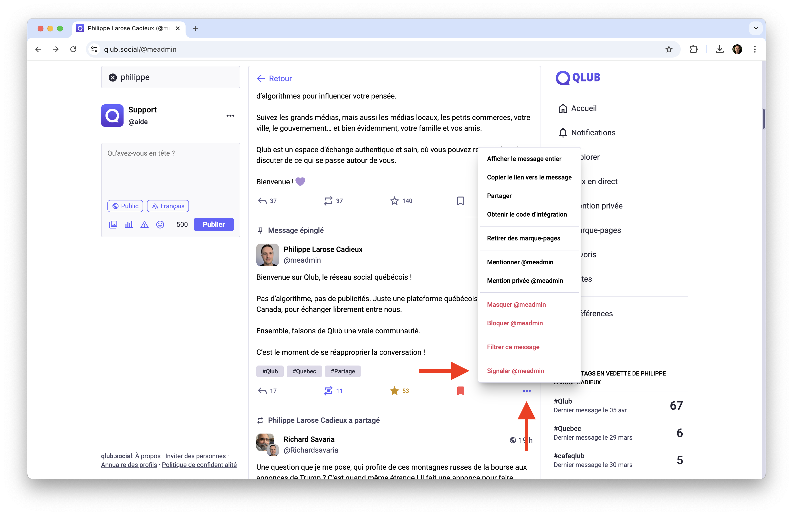
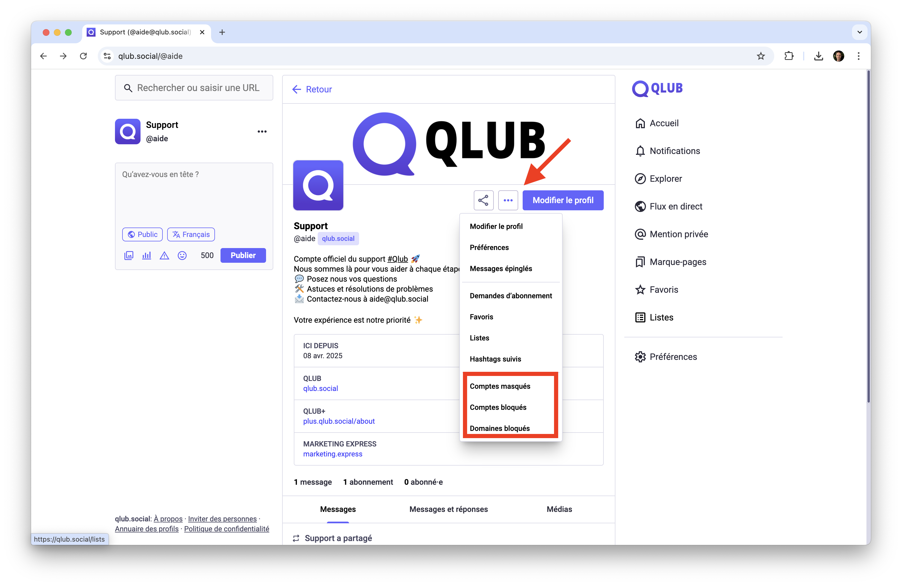

# 🚨 Gérer les interactions et la modération sur Qlub

Ce guide explique comment gérer vos interactions avec d'autres comptes et signaler du contenu sur Qlub.

## Masquer un compte

Masquer un compte vous permet de ne plus voir ses publications dans vos fils d'actualité sans le bloquer. L'utilisateur ne sera pas notifié.

### Comment masquer un compte
1. Accédez au profil du compte que vous souhaitez masquer
2. Cliquez sur les trois points (...) pour ouvrir le menu d'options
3. Sélectionnez "Masquer @utilisateur"

## Bloquer un compte

Bloquer un compte empêche cet utilisateur de vous suivre, de voir vos publications verrouillées, de vous mentionner, et vous empêche de voir ses publications (sauf si mentionné par quelqu'un que vous suivez). L'utilisateur ne sera pas notifié.

### Comment bloquer un compte
1. Accédez au profil du compte que vous souhaitez bloquer
2. Cliquez sur les trois points (...) pour ouvrir le menu d'options
3. Sélectionnez "Bloquer @utilisateur"

## Signaler

Vous pouvez signaler des publications ou des comptes aux modérateurs de votre serveur si vous pensez qu'ils enfreignent les règles.

### Comment signaler un compte ou une publication
1. Accédez au compte ou à la publication que vous souhaitez signaler
2. Cliquez sur les trois points (...) pour ouvrir le menu d'options
3. Sélectionnez "Signaler @utilisateur"

4. Choisissez la ou les raisons du signalement
5. Ajoutez des commentaires supplémentaires si nécessaire
6. Cliquez sur "Envoyer le signalement"

## Gérer ses comptes et domaines bloqués

Vous pouvez consulter et gérer la liste des comptes et des domaines que vous avez bloqués.

### Comment accéder à la liste
1. Accédez à votre profil
2. Cliquez sur les trois points (...) pour ouvrir le menu d'options
3. Sélectionnez "Comptes bloqués", "Comptes masqués" ou "Domaines bloqués" selon ce que vous souhaitez gérer
4. Vous pouvez alors débloquer des comptes ou domaines en cliquant sur le bouton "Débloquer" à côté de chaque élément

## ➡️ Guide suivant

Découvrez comment publier du contenu sur Qlub :
[✍️ Publications](publishing.md)

---

[🏠 Retour à l'accueil](../index.md)
