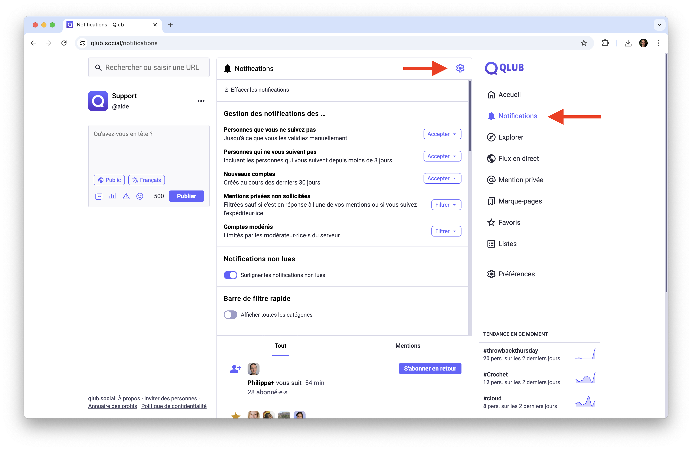

# 🔔 Gérer les notifications sur Qlub

Ce guide vous explique comment configurer et gérer vos notifications sur Qlub.

## ⚙️ Fonctionnement

Les notifications vous informent des activités importantes sur votre compte.

### Types de notifications
- **Navigateur** : Alertes en temps réel sur votre navigateur
- **Push** : Notifications envoyées à votre appareil mobile
- **Email** : Résumés et alertes envoyés à votre adresse email

### Quand les notifications sont-elles envoyées ?
- Nouveaux abonnés
- Mentions dans des publications
- Messages privés reçus
- Réponses à vos publications
- Favoris sur vos publications
- Repartages de vos publications

## 🛠️ Gérer les notifications

Personnalisez vos préférences de notification pour mieux contrôler les alertes.

### Accéder aux paramètres
1. Cliquez sur l'icône d'engrenage (⚙️) en haut à droite de la page des notifications
2. Les paramètres de notification s'afficheront dans un panneau

## 📧 Gérer les notifications par courriel

Recevez des résumés et alertes par email selon vos préférences.

### Configurer les emails
1. Accédez à "Paramètres" > "Notifications"
2. Sélectionnez "Notifications par email"
3. Choisissez la fréquence et le type d'alertes

## ➡️ Guide suivant

Découvrez comment inviter de nouvelles personnes sur Qlub :
[✉️ Invitations](invitations.md)

---

[🏠 Retour à l'accueil](../index.md)
