# 👤 Configurer votre profil

Ce guide vous aide à configurer votre profil Qlub pour qu'il reflète votre identité et vos préférences de confidentialité.

## 🔧 Accéder à la page de modification

Pour modifier votre profil, vous pouvez suivre l'un des deux chemins suivants :

### Par le profil
1. Cliquez sur votre avatar actuel dans le coin supérieur droit
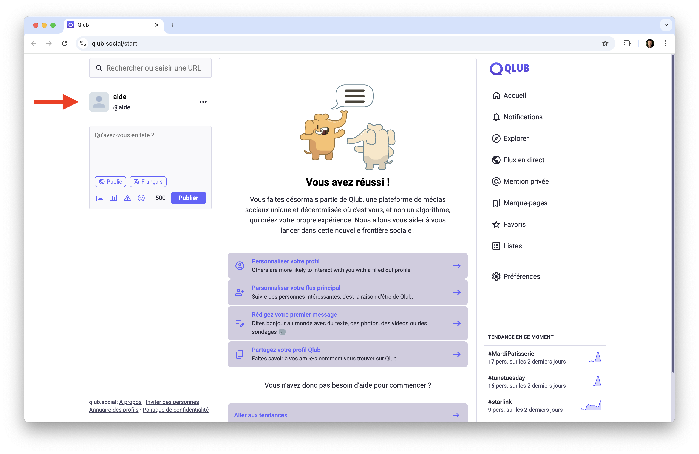

2. Sélectionnez "Modifier le profil" dans le menu déroulant
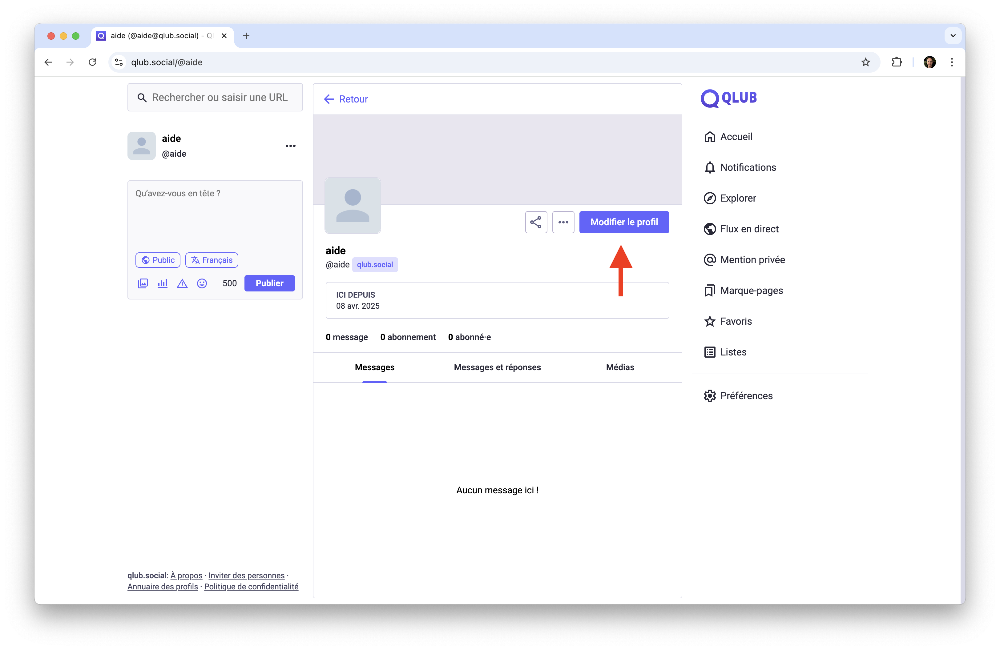

### Par les préférences
1. Allez dans "Paramètres" depuis le menu principal
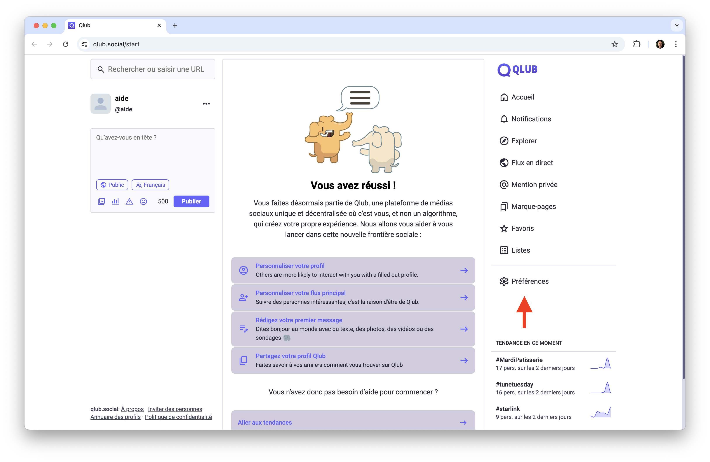
2. Sélectionnez "Profil" dans la liste des options
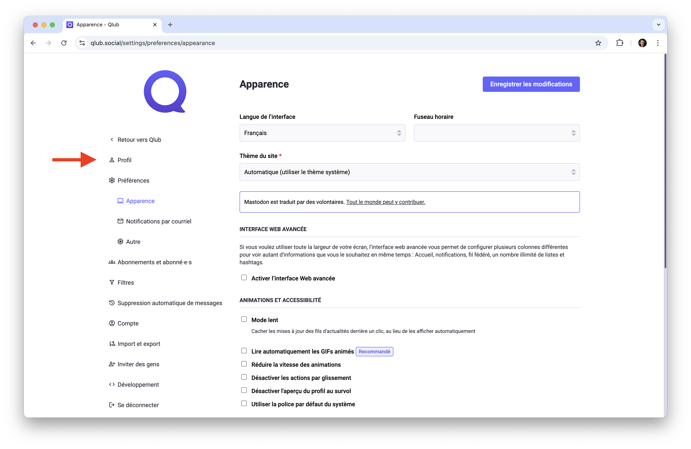

## 📝 Informations de base

### Nom public
- Peut contenir jusqu'à 30 caractères
- Peut inclure des émojis
- Visible par tous les utilisateurs
- Pour le modifier :
  1. Allez dans "Modifier le profil"
  2. Modifiez le champ "Nom public"
  3. Enregistrez les modifications au bas de la page

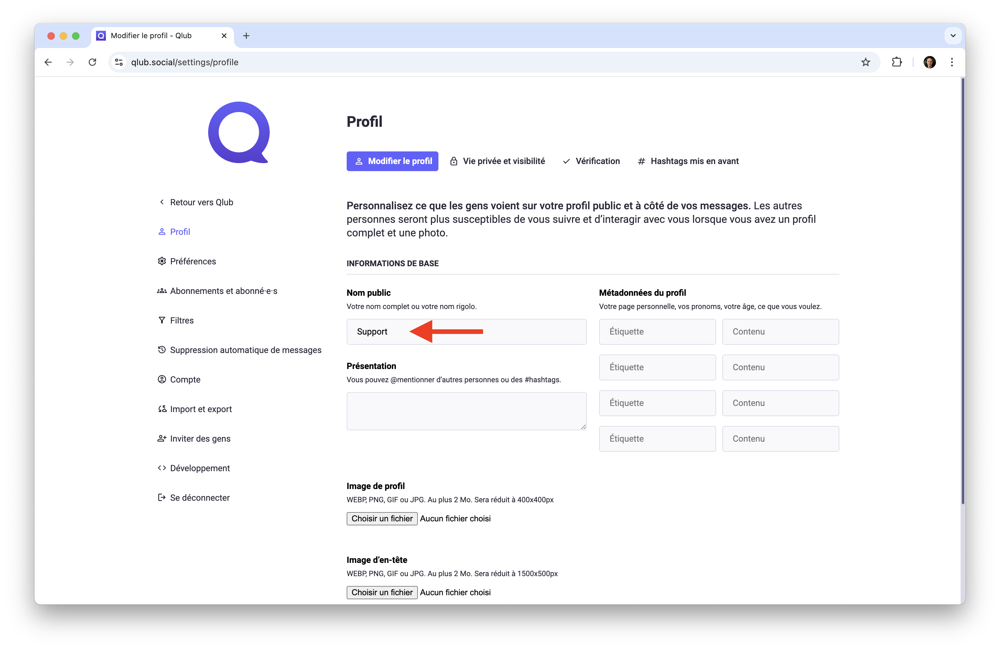

### Présentation
- Jusqu'à 500 caractères
- Peut inclure des liens, des hashtags ou des mentions @
- Peut contenir des émojis
- Pour la modifier :
  1. Accédez à "Modifier le profil"
  2. Rédigez votre texte dans le champ prévu
  3. Enregistrez les modifications au bas de la page

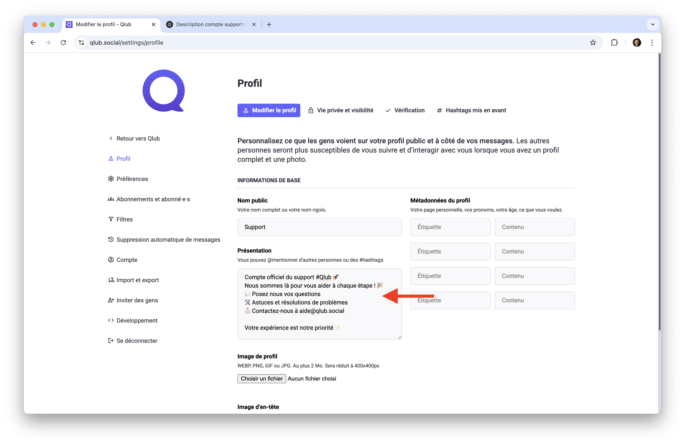

### Image de profil
- Formats acceptés : WEBP, JPG, PNG ou GIF
- Taille maximale : 2 Mo
- Dimensions recommandées : 400x400 pixels
- Pour changer votre photo :
  1. Allez dans "Modifier le profil"
  2. Cliquez sur "Choisir un fichier"
  3. Sélectionnez une image dans votre navigateur de fichiers
  4. Enregistrez les modifications

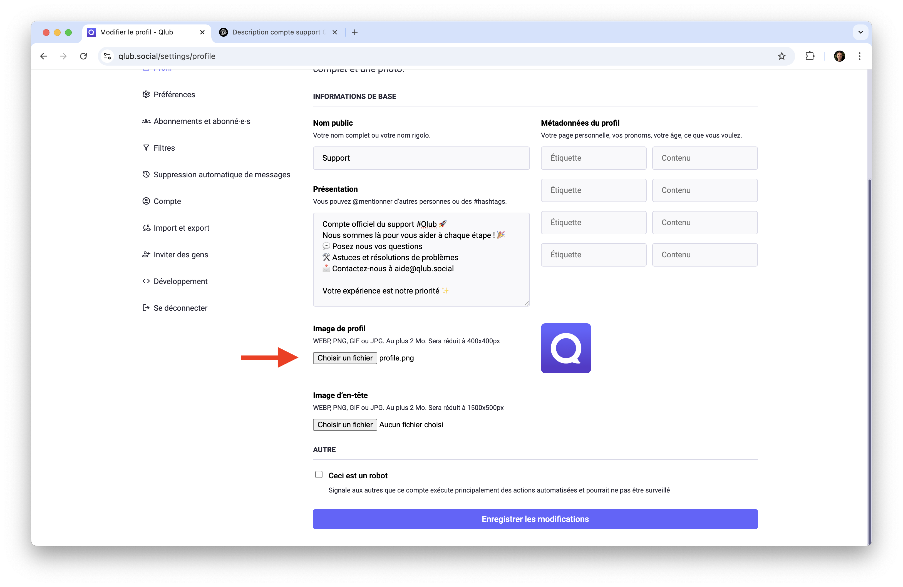

### Image d'en-tête
- Formats acceptés : WEBP, JPG, PNG ou GIF
- Taille maximale : 2 Mo
- Dimensions recommandées : 1500x500 pixels
- Pour changer votre photo :
  1. Allez dans "Modifier le profil"
  2. Cliquez sur "Choisir un fichier"
  3. Sélectionnez une image dans votre navigateur de fichiers
  4. Enregistrez les modifications
  
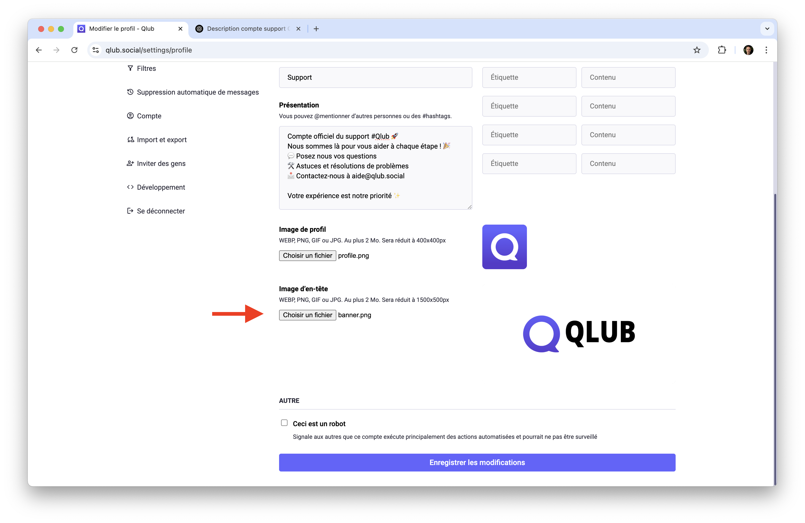

### Sauvegarder les modifications
- Les modifications ne sont pas appliquées automatiquement
- Pour enregistrer vos changements :
  1. Faites défiler jusqu'au bas de la page "Modifier le profil"
  2. Cliquez sur le bouton "Enregistrer les modifications"
  3. Vos changements seront immédiatement appliqués

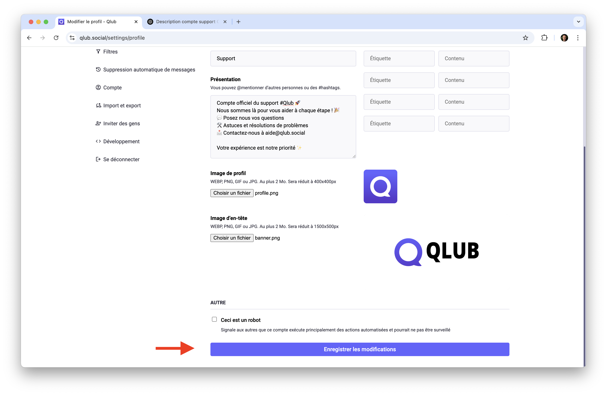

### Métadonnées du profil
- Jusqu'à 4 champs personnalisables
- Peut inclure des liens, des hashtags ou des mentions @
- Peut contenir des émojis
- Pour les modifier :
  1. Accédez à "Modifier le profil"
  2. Rédigez vos étiquettes et contenus dans les champs prévus
  3. Enregistrez les modifications au bas de la page

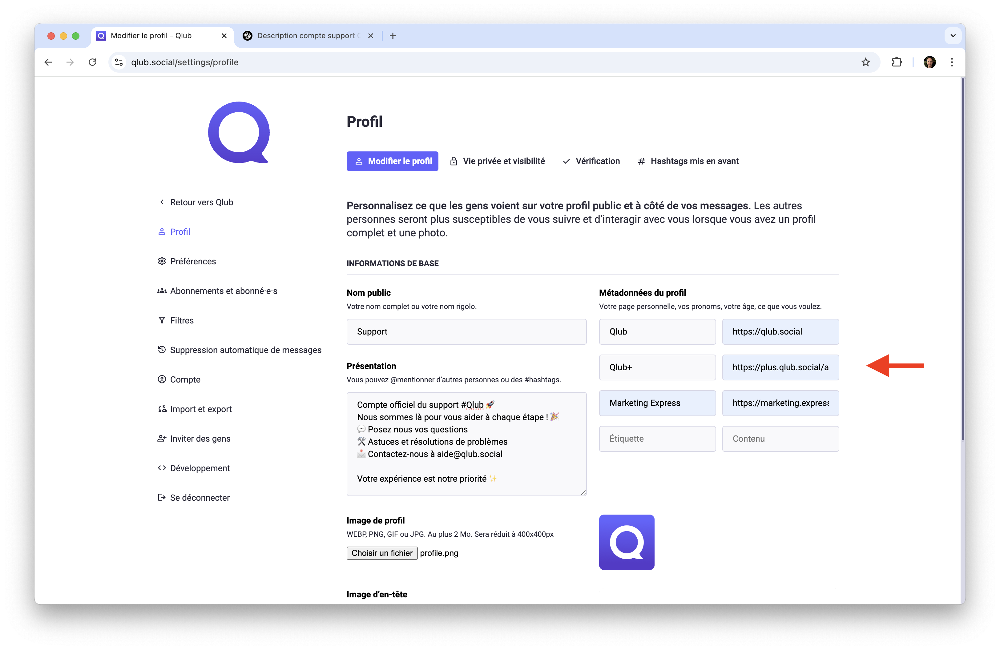

## 👀 Vie privée et visibilité

Personnalisez la façon dont votre profil et vos messages peuvent être découverts. Qlub peut vous aider à atteindre un public plus large lorsque certains paramètres sont activés. Prenez le temps de les examiner pour vous assurer qu'ils sont configurés comme vous le souhaitez.

Pour modifier vos paramètres de confidentialité :
1. Accédez à "Vie privée et visibilité"
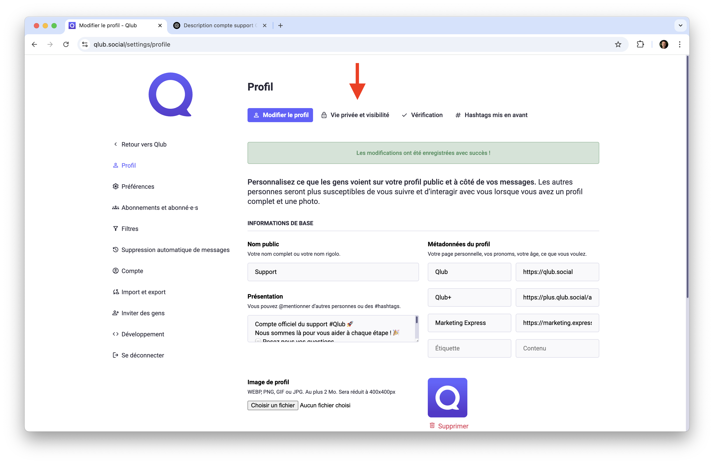
2. Cochez ou décochez les options désirées
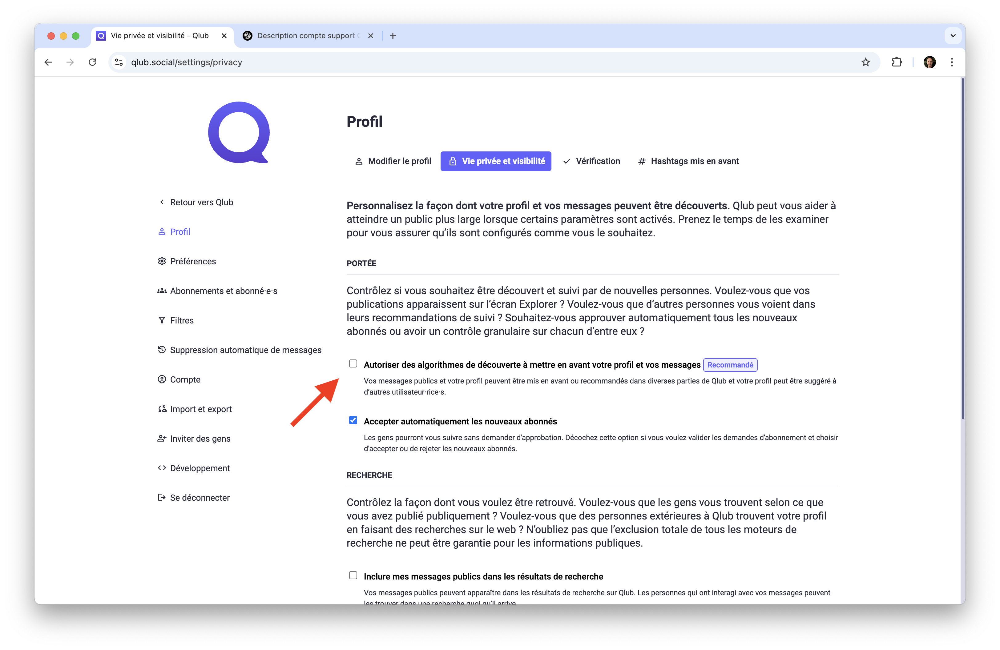
3. Enregistrez les modifications au bas de la page
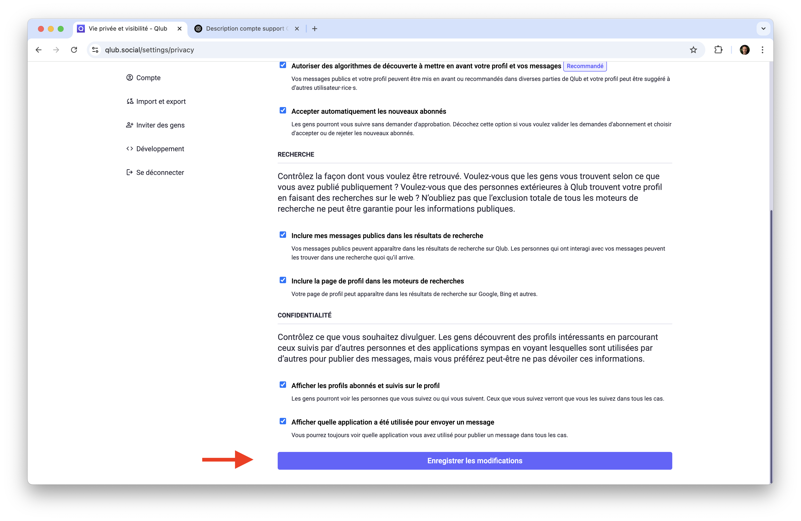

## ➡️ Guide suivant

Découvrez comment naviguer et interagir avec les différents fils d'actualités de Qlub :
[📰 Les fils d'actualité](timelines.md)

---

[🏠 Retour à l'accueil](../index.md)