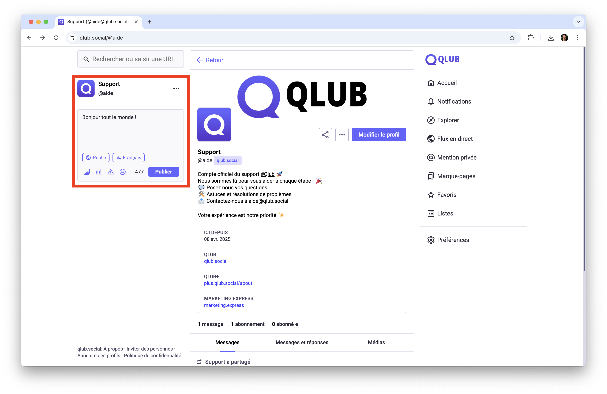
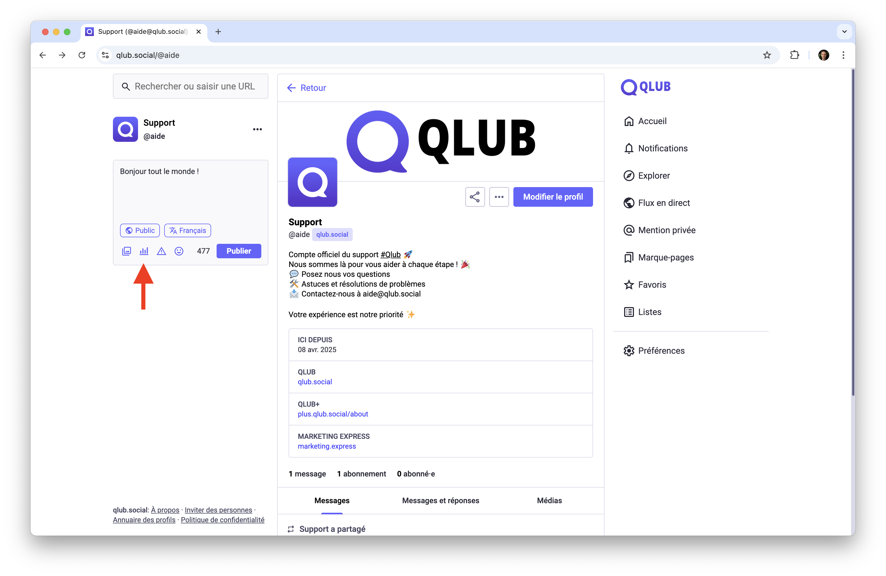
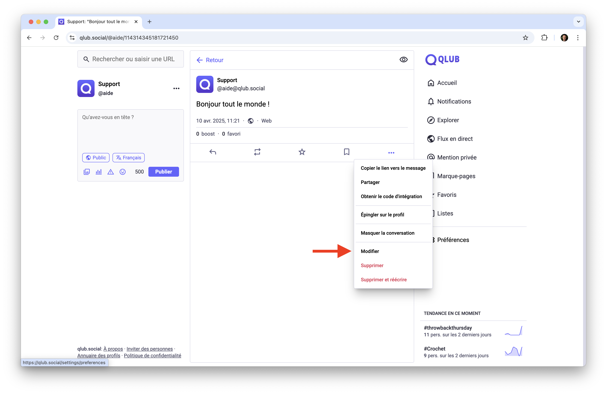
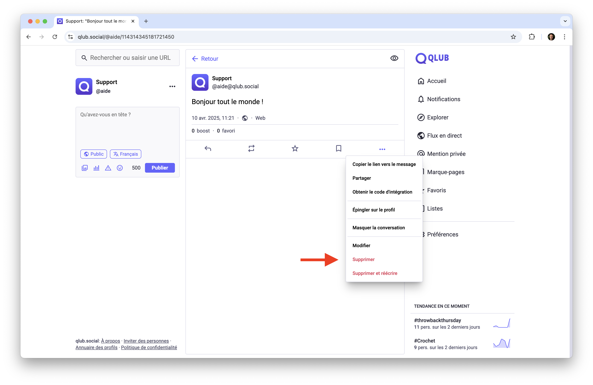

# 📝 Publier sur Qlub

Ce guide vous explique comment publier du contenu sur Qlub.

## ✍️ Texte

Publiez des messages textuels pour partager vos pensées et idées.

### Comment publier un message
1. Cliquez sur le champ de texte en haut à gauche de la page
2. Écrivez votre message
3. Ajoutez des mentions et hashtags si nécessaire
4. Choisissez la visibilité de votre message
5. Cliquez sur "Publier"

## 🖼️ Images

Ajoutez des images à vos messages.

### Comment ajouter des images
1. Cliquez sur l'icône "Ajouter une image"
2. Sélectionnez une ou plusieurs images à télécharger 
3. Ajoutez des descriptions pour l'accessibilité

### Limites par type de compte
- **Qlub** : Limite de 4 images par message, taille maximale de 16 Mo par image
- **Qlub+** : Limite de 8 images par message, taille maximale de 32 Mo par image

## 🎥 Vidéos et audio

Ajoutez des vidéos ou des fichiers audio à vos messages.

### Comment ajouter des médias
1. Cliquez sur l'icône "Ajouter média"
2. Sélectionnez un fichier vidéo ou audio à télécharger
3. Ajoutez une description pour l'accessibilité

### Limites par type de compte
- **Qlub** : Taille maximale de 99 Mo et durée d'environ 5 minutes à 120 fps
- **Qlub+** : Taille maximale de 200 Mo et durée d'environ 10 minutes à 120 fps

## 📊 Sondages

Créez des sondages pour interagir avec vos abonnés.

### Comment créer un sondage
1. Cliquez sur l'icône "Ajouter un sondage"
2. Entrez les options de réponse
3. Choisissez la durée du sondage

### Limites par type de compte
- **Qlub** : Limite de 4 choix
- **Qlub+** : Limite de 10 choix

## 🛠️ Gérer vos messages

### Modifier un message
1. Trouvez le message que vous souhaitez modifier
2. Cliquez sur les trois points (...) à côté du message
3. Sélectionnez "Modifier"
4. Apportez les modifications nécessaires
5. Cliquez sur "Mettre à jour" pour modifier le message

### Supprimer un message
1. Trouvez le message que vous souhaitez supprimer
2. Cliquez sur les trois points (...) à côté du message
3. Sélectionnez "Supprimer"
4. Confirmez la suppression du message

## ➡️ Guide suivant

Découvrez comment gérer la visibilité de vos publications :
[🔒 Visibilité des messages](visibility.md)

---

[🏠 Retour à l'accueil](../index.md)
