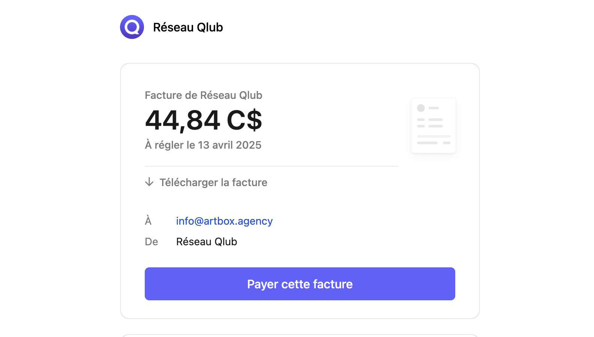
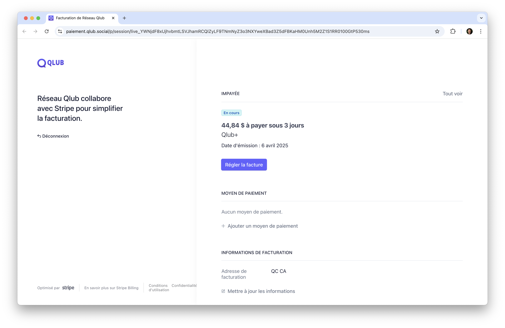

  

# 🏆 Qlub+ - Version payante de Qlub

Qlub+ est la version payante de Qlub, offrant des fonctionnalités exclusives et un support prioritaire. En achetant un plan Qlub+, vous contribuez à notre mission de bâtir un écosystème numérique souverain.

## 😎 Qlub vs. Qlub+

Qlub est gratuit pour tous. Qlub+ sert à financer Qlub pour ceux qui désirent davantage de fonctionnalités. En achetant un plan Qlub+, vous contribuez à notre mission de bâtir un écosystème numérique souverain.

| Fonctionnalité | Qlub | Qlub+ |
|-|-|-|
| Caractères par message | 500 | 5000 |
| Images par message | 4 | 8 |
| Taille maximale des images | 16 Mo | 32 Mo |
| Taille maximale des vidéos/audios | 99 Mo | 200 Mo |
| Choix par sondage | 4 | 10 |
| Flux en direct | Qlub | Qlub+ |
| Prix | Gratuit | 59 $/an |

 

  <a href="https://plus.qlub.social/auth/sign_up" style="display: inline-block; background-color: #6161ff; color: white; padding: 15px 30px; text-decoration: none; border-radius: 5px; font-weight: bold; font-size: 18px;">
    S'abonner à Qlub+ pour 59 $/an
  </a>

 

## 🫶 Lien entre Qlub et Qlub+

Qlub+ est conçu pour s'intégrer parfaitement avec Qlub, offrant une transition fluide pour les utilisateurs existants.

- **Compatibilité totale** : Qlub+ maintient la compatibilité avec Qlub.
- **Migration facile** : Utilisez l'outil de migration pour transférer vos abonnements et listes.

## 🚀 Fonctionnement pour la création du compte

Créer un compte Qlub+ est simple et rapide.

1. Visitez [plus.qlub.social](https://plus.qlub.social)
2. Créez votre compte Qlub+
3. Recevez un lien pour effectuer le paiement par carte de crédit

## ⚙️ Modifier l'abonnement et vos informations de paiement

Gérez votre abonnement et vos informations de paiement directement depuis votre compte.

1. Cliquez sur le bouton "Gérer les abonnements" dans le courriel de votre facture
2. Entrez votre adresse courriel de facturation. Un courriel avec le lien pour votre portail vous sera envoyé
3. Cliquez sur le bouton "Me connecter à mon portail client"

## ➡️ Guide suivant

Découvrez comment migrer de Qlub vers Qlub+ :
[🔄 Passer de Qlub vers Qlub+](migration-to-plus.md)

---

[🏠 Retour à l'accueil](../index.md)
