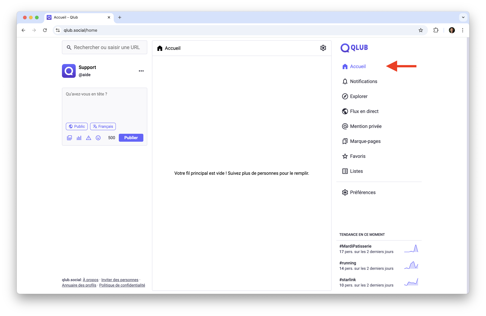
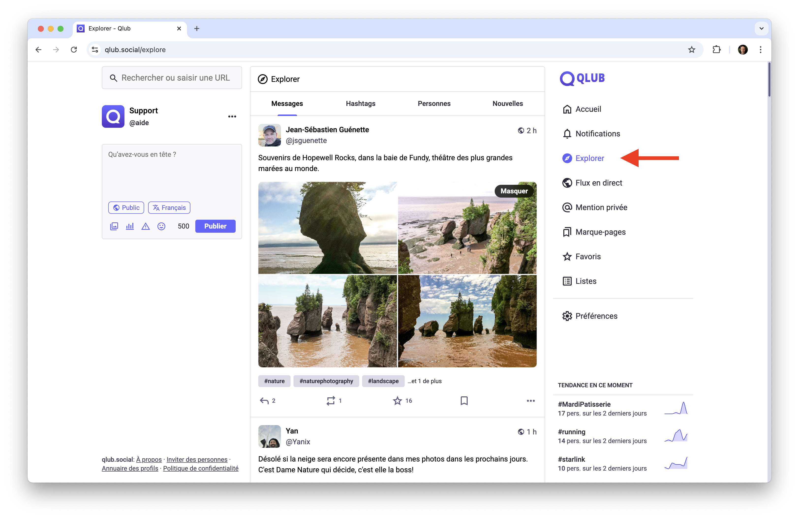
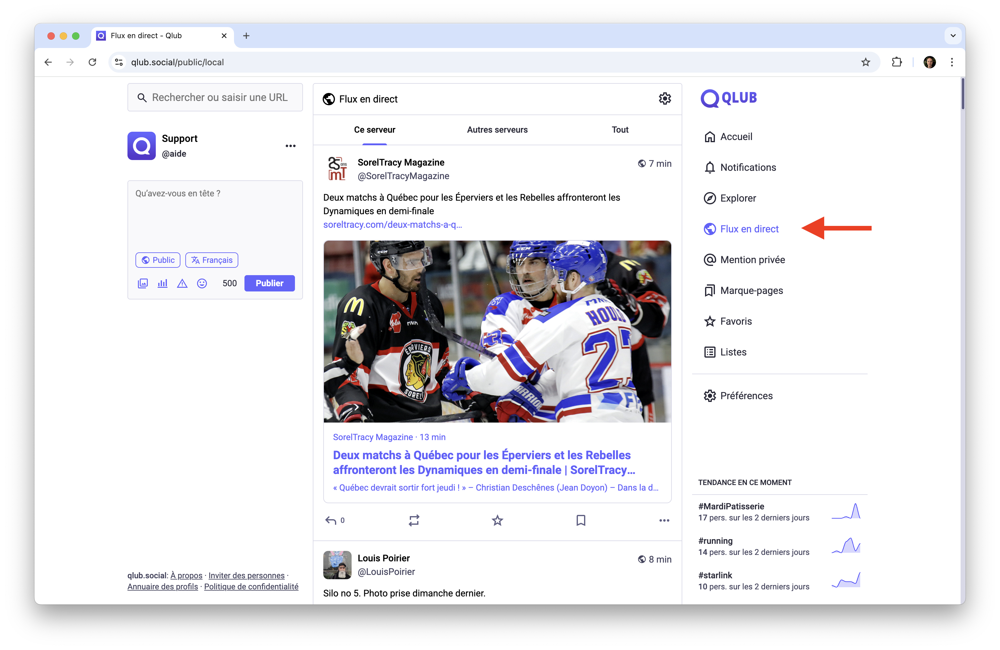

# 📰 Les fils d'actualité sur Qlub

Ce guide vous explique les différents fils d'actualité disponibles sur Qlub pour découvrir et suivre du contenu.

## 🏠 Accueil

Le fil d'actualité principal affiche les publications des comptes que vous suivez. Si vous ne suivez personne, il sera vide, ce qui est normal.

### Contenu affiché
- Publications des comptes suivis
- Repartages de vos abonnements
- Réponses et interactions
- Mentions vous concernant

### Navigation
- Cliquez sur l'icône "Maison" dans la barre de navigation pour accéder au fil d'actualité principal

## 🔍 Explorer

L'espace de découverte pour trouver du nouveau contenu et suivre les tendances.

### Sections disponibles
- Tendances du moment
- Publications populaires
- Hashtags actifs
- Comptes suggérés

### Navigation
- Cliquez sur l'icône "Boussole" dans la barre de navigation

## 🌎 Flux en direct

Le flux en direct affiche toutes les publications sans filtre, vous permettant de voir l'activité en temps réel sur Qlub.

### Utilisation
- Cliquez sur l'icône "Globe" dans la barre de navigation pour accéder au flux en direct

## ➡️ Guide suivant

Découvrez comment trouver et suivre des comptes intéressants sur Qlub :
[👥 Suivre des comptes](following.md)

---

[🏠 Retour à l'accueil](../index.md)