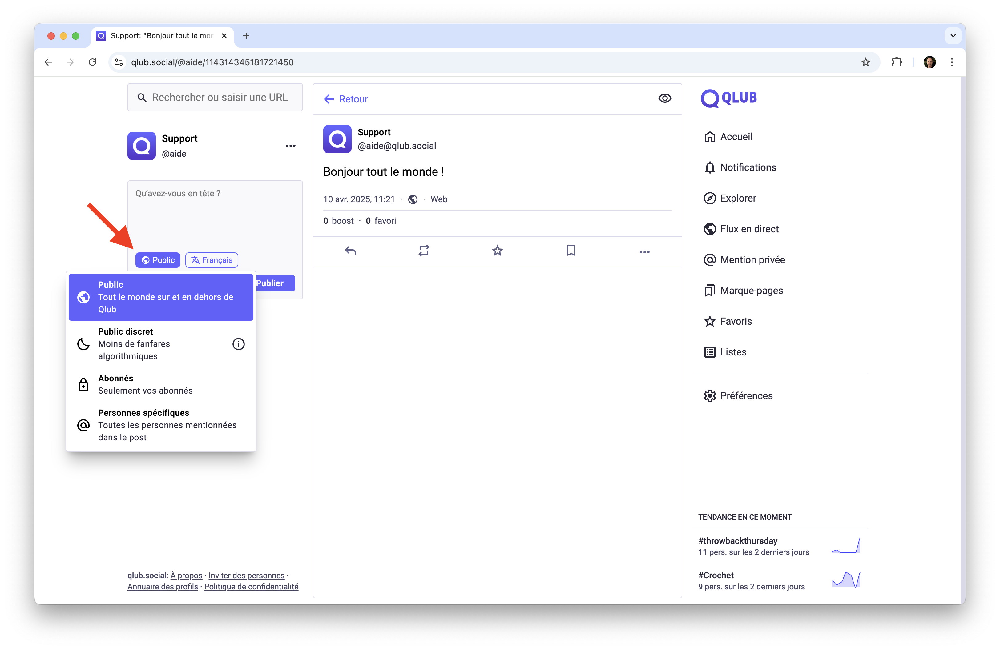

# 🔒 Visibilité des messages

Ce guide vous explique comment contrôler la visibilité de vos messages sur Qlub. La visibilité détermine qui peut voir votre contenu. Vous pouvez l'ajuster à tout moment pour mieux contrôler votre audience.

### Choisir la visibilité d'un message
1. Lors de la rédaction d'un message, cliquez sur l'icône de visibilité (🌐 par défaut)
2. Sélectionnez l'une des options de visibilité :
   - 🌐 Public
   - ☾ Public discret
   - 🔒 Abonnés
   - ＠ Personnes spécifiques
3. Votre message sera publié avec la visibilité choisie

## 🌐 Public

Les messages publics sont visibles par tous les utilisateurs.

### Caractéristiques
- Visible par tous, même sans compte Qlub
- Apparaît dans les résultats de recherche
- Peut être partagé

### Cas d'utilisation
- Informations générales
- Communication grand public
- Discussions ouvertes

## ☾ Public discret 

Les messages publics discrets sont visibles sur votre profil uniquement.

### Caractéristiques
- Visible sur votre profil
- N'apparaît pas dans le flux public
- N'apparaît pas dans les recherches

### Cas d'utilisation  
- Partage avec vos abonnés
- Discussions moins visibles
- Publications informelles

## 🔒 Abonnés

Les messages pour abonnés sont visibles uniquement par vos abonnés.

### Caractéristiques
- Visible par vos abonnés uniquement
- N'apparaît pas dans les recherches
- Pas de partage public possible

### Cas d'utilisation
- Discussions privées avec abonnés
- Contenu exclusif
- Interactions personnelles

## ＠ Personnes Spécifiques (Mentions privées)

Les messages avec mentions privées sont visibles uniquement par les utilisateurs mentionnés.

### Caractéristiques
- Visible par les personnes mentionnées uniquement
- N'apparaît pas dans les recherches
- Pas de partage possible

### Cas d'utilisation
- Conversations privées
- Messages confidentiels  
- Discussions ciblées

### ⚠️ Avertissement

Les messages ne sont pas chiffrés. Ne partagez pas d'informations sensibles via les mentions privées. Qlub n'est pas une messagerie chiffrée. Les administrateurs des serveurs peuvent avoir accès au contenu.

## ➡️ Guide suivant

Découvrez comment mentionner d'autres utilisateurs :
[@ Mentions et mentions privées](mentions.md)

---

[🏠 Retour à l'accueil](../index.md)
