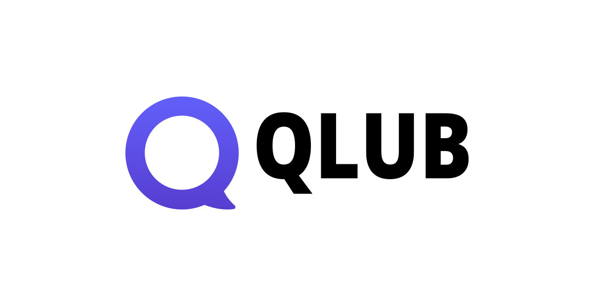

  

# 🚑 Centre d'aide Qlub

Bienvenue dans le centre d'aide de Qlub ! Ce guide vous accompagnera dans l'utilisation de notre plateforme sociale québécoise et sa version payante Qlub+.

> **Note** Qlub est bâti sur Mastodon, un logiciel de réseau social libre et décentralisé. Pour en savoir plus sur les fonctionnalités de base de la plateforme, vous pouvez consulter la [documentation officielle de Mastodon](https://docs.joinmastodon.org/).

## 💁 À propos de Qlub

Qlub est la plateforme sociale québécoise qui vous redonne accès à l'information. Ici, vous pouvez vous informer, découvrir du contenu pertinent et interagir dans un environnement respectueux, sans algorithmes oppressants ni publicité imposée.

- 🇨🇦 **Solution locale** : Qlub est hébergé au Canada (bientôt au Québec) pour garantir notre souveraineté numérique.
- 💬 **Interactions authentiques** : Pas de contenu dicté par un algorithme oppressant, mais des échanges basés sur l'intérêt réel des utilisateurs.
- 🔒 **Respect de la vie privée** : Pas de collecte abusive ni de revente de données. Qlub privilégie la transparence et la confidentialité.
- 🌍 **Alternative décentralisée** : Bâtie sur Mastodon, Qlub peut interagir avec d'autres plateformes ouvertes compatibles avec le Fédivers.

## 😎 Qlub vs. Qlub+
Qlub est gratuit pour tous. Qlub+ sert à financer Qlub pour ceux qui désirent davantage de fonctionnalités. En achetant un plan Qlub+, vous contribuez à notre mission de bâtir un écosystème numérique souverain. 💜

| Fonctionnalité | Qlub | Qlub+ |
|-|-|-|
| Caractères par message | 500 | 5000 |
| Images par message | 4 | 8 |
| Taille maximale des images | 16 Mo | 32 Mo |
| Taille maximale des vidéos/audios | 99 Mo | 200 Mo |
| Choix par sondage | 4 | 10 |
| Flux en direct | Qlub | Qlub+ |
| Prix | Gratuit | 59 $/an |

 

  <a href="https://plus.qlub.social/auth/sign_up" style="display: inline-block; background-color: #6161ff; color: white; padding: 15px 30px; text-decoration: none; border-radius: 5px; font-weight: bold; font-size: 18px;">
    S'abonner à Qlub+ pour 59 $/an
  </a>

 

## 🚀 Guides de démarrage

### 👤 Configurer votre profil
- [Créer un compte](guides/create-account.md) - Apprenez comment créer votre compte sur Qlub

- [Compléter votre profil](guides/profile.md) - Personnaliser votre profil et vos préférences

### 🔎 Trouver du contenu

- [Fils d'actualité](guides/timelines.md) - Comprendre et personnaliser vos fils d'actualité

- [Suivre des comptes](guides/following.md) - Rechercher, suivre et gérer vos abonnements

- [Interagir avec le contenu](guides/interacting.md) - Favoris, repartage, réponses et autres interactions

- [Listes](guides/lists.md) - Créer et gérer des listes de comptes

- [Hashtags](guides/hashtags.md) - Utiliser et suivre des hashtags

- [Modération](guides/moderation.md) - Gérer le contenu et les interactions

### ✍️ Partager du contenu

- [Publications](guides/publishing.md) - Créer et gérer vos messages

- [Visibilité des messages](guides/visibility.md) - Gérer la visibilité de vos publications

- [Mentions et mentions privés](guides/mentions.md) - Communiquer avec d'autres utilisateurs

### ⚙️ Gérer votre compte

- [Sécurité](guides/security.md) - Protéger votre compte

- [Notifications](guides/notifications.md) - Gérer vos notifications

- [Inviter des personnes](guides/invitations.md) - Inviter de nouveaux utilisateurs sur Qlub

- [Application mobile](guides/mobile.md) - Utiliser Qlub sur mobile

### 💜 Contribuer à Qlub

- [Qlub+](guides/qlub-plus.md) - Fonctionnalités additionnelles

- [Passer de Qlub vers Qlub+](guides/migration-to-plus.md) - Migrer vers Qlub+

## Liens utiles
[Accéder à la version gratuite de Qlub](https://qlub.social)

[Accéder à la version payante Qlub+](https://plus.qlub.social)

[Nous contacter](mailto:aide@qlub.social)